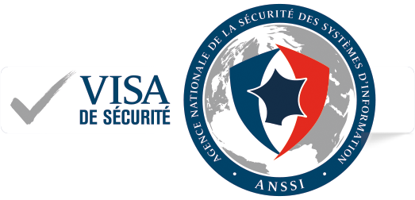

.. Reminder for header structure :
   Niveau 1 : ====================
   Niveau 2 : --------------------
   Niveau 3 : ++++++++++++++++++++
   Niveau 4 : """"""""""""""""""""
   Niveau 5 : ^^^^^^^^^^^^^^^^^^^^

.. meta::
   :description: WAPT Documentation
   :keywords: Documentation, WAPT, introduction, welcome page, Welcome

.. |date| date::

WAPT Documentation
==================

.. image:: logo_wapt_all.png
  :align: center
  :alt: WAPT Logo

Welcome to WAPT's official documentation by Tranquil IT,
last compiled on |date|.

WAPT is a software deployment tool whose core set of features
is licensed under the GPLv3.

WAPT exists in two flavors, :ref:`WAPT Community
and WAPT Enterprise <WAPT_Enterprise>`.

Security Certification
----------------------

  Security Visa from ANSSI dated 14th of February 2018
  for WAPT Enterprise Edition 1.5.0.13

  Cybersecurity solutions are many and diverse, but not all of them offer
  the same level of effectiveness, robustness and trust

  Security Visas that the French cyberdefense agency, ANSSI, delivers allow to
  identify more easily the most reliable security solutions. They are recognized
  as such after having been evaluated by approved laboratories following
  a rigorous and recognized methodology.

Security Certification from French Cyberdefense Agency ANSSI
------------------------------------------------------------

Following its first level security certification obtained on 14 february 2018,
WAPT has been prized with a `higher level certification <https://www.tranquil.it/wp-content/uploads/qualification-anssi-tranquil-it.pdf>`_
from ANSSI.

Main features
-------------

**For System Administrators**:

* install software and configurations silently;

* maintain up to date an installed base of software and configurations;

* configure software at the system and user level to reduce the load
  on support teams;

* remove unwanted or out of cycle software and configurations silently;

* give :term:`Users` more autonomy to install software safely and reliably;

* reduce as much as possible the consumption of bandwidth on remote sites
  to preserve it for productive uses;

**For IT Security Officers**

* pilot the software installed base to converge to a security
  standard acceptable to the Organization;

* prepare your enterprise for the coming
  `GDPR <https://en.wikipedia.org/wiki/General_Data_Protection_Regulation>`_
  and help your DPO keep his register of data processing,
  because you two will become close colleagues;

* to no more tolerate machines operating in *Administrator* mode;

* reduce the level of exposure to software vulnerabilities and
  `lateral movement attacks <https://en.wikipedia.org/wiki/Network_Lateral_Movement>`_;

* bring up audit indicators for a better knowledge of the state of installed
  IT devices and their global security level;

* be prompt to deploy updates to react to cyber attacks like
  `Wannacry <https://www.us-cert.gov/ncas/current-activity/2017/05/17/ICS-CERT-Releases-WannaCry-Fact-Sheet>`_
  or `notPetya <https://www.us-cert.gov/sites/default /files/publications/MIFR-10130295.pdf>`_;

**For End-Users**

* have your software configured to work well in the context
  of your Organization and trust that they will work correctly;

* reduce your need for support by your IT teams, whose reaction times
  are often long because of their workloads;

* to build a better contact with your IT support teams because IT works better
  as malfunctions happen less often because of standard, better managed
  and more predictable software configurations

Source code repository
----------------------

You may access the source code by visiting Tranquil IT's GitHub
repository located at https://github.com/tranquilit/WAPT.

How to contribute?
------------------

You may want to have a look at our
:ref:`contribution guide <how_to_contribute>`.

WAPT support and training
-------------------------

* commercial support: https://www.tranquil.it/

* forum: https://forum.tranquil.it/

* mailing list: http://lists.tranquil.it/listinfo/wapt

.. toctree::
  :maxdepth: 1
  :caption: Documentation

  wapt-concept/index.rst
  wapt-security-principles/index.rst
  wapt-enterprise.rst

.. toctree::
  :maxdepth: 1
  :caption: Documentation

  waptserver-install/index.rst
  wapt-configuration/index.rst
  wapt-usage/index.rst
  waptserver-update/index.rst
  waptserver-backup.rst
  wapt-replication/index.rst
  wapt-create-packages/index.rst
  wapt-common-problems/index.rst

.. toctree::
  :maxdepth: 1
  :caption: Appendix

  wapt-glossary.rst
  wapt-roadmap.rst
  wapt-contribute/index.rst
  wapt-changelog.rst
  wapt-licence.rst
  tranquil-it-contacts.rst

Indices and tables
==================

* :ref:`genindex`

* :ref:`glossary`

* :ref:`search`
