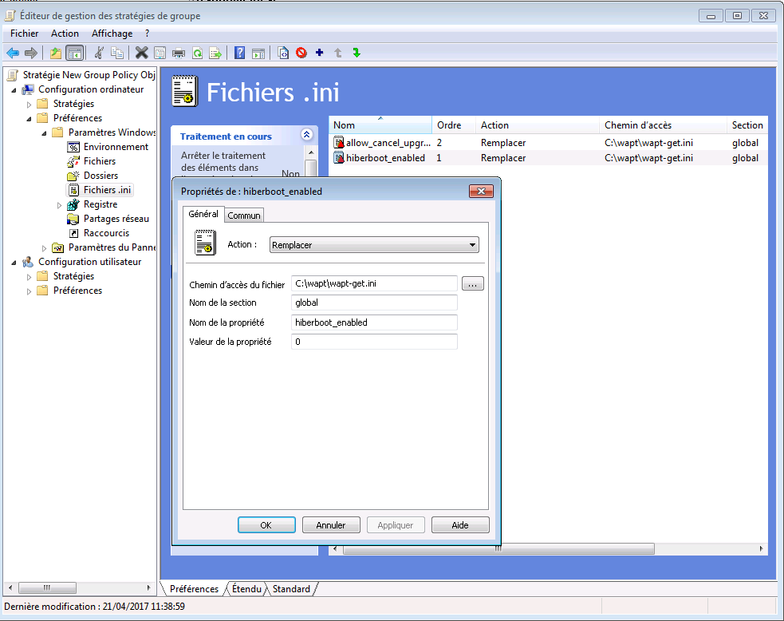

.. Reminder for header structure:
   Niveau 1: ====================
   Niveau 2: --------------------
   Niveau 3: ++++++++++++++++++++
   Niveau 4: """"""""""""""""""""
   Niveau 5: ^^^^^^^^^^^^^^^^^^^^

.. meta::
  :description: Frequent problems
  :keywords: lost password, lost private key, stolen private key,
             BIOS bug, waptdeploy, WAPT, documentation

.. _wapt_faq:

Frequent problems
=================

I have lost my SuperAdmin password
----------------------------------

It sometimes happens to setup a WAPT Server and then forget its password.

To reset the WAPT console :term:`SuperAdmin` password you have to relaunch
the post-configuration process on the WAPT Server.

Resetting the WAPT Linux Server password
++++++++++++++++++++++++++++++++++++++++

* connect to the server with SSH;

* connect with user root (or use sudo);

* launch post-configuration script:

.. code-block:: bash

  /opt/wapt/waptserver/scripts/postconf.sh

.. attention::

  To avoid breaking the existing WAPT Server setup, accept all the other steps,
  **DO NOT CREATE a new private key**!

I lost my WAPT private key
--------------------------

WAPT's security and its correct functioning rely on sets of private keys
and public certificates.

Losing a private key thus requires to generate a new key and
its associated certificates, and then to deploy the new keys
and the new certificates on the Organization's computers.

Therefore, losing a key bears some consequences, the process to recover
from a lost key is not trivial, although it is relatively simple.

Generating or renewing a private key
++++++++++++++++++++++++++++++++++++

The procedure is:

* generate a new private key/ public certificate. You will then keep
  the private key (file :mimetype:`.pem`) in a safe location;

* deploy the new certificate :mimetype:`.crt` on your clients in the folder
  :file:`C:\\Program Files (x86)\\ssl` manually or using
  a :abbr:`GPO (Group Policy Object)`;

Re-signing packages in the repositories
"""""""""""""""""""""""""""""""""""""""

WAPT packages hosted on the repositories were signed using
the former private key, so you must re-sign every package of the repository
using the new key.

To re-sign every WAPT packages using the new key
(*base*, *host*, *group* and *unit* packages), use the command:

.. code-block:: bash

  wapt-get sign-packages C:\\waptdev\\*

My private key has been stolen
------------------------------

.. attention::

  **WAPT security relies on protecting your private keys.**

WAPT does not handle key revocation yet using a :abbr:`CRL (Certificate
Revocation List)`.

The solution consists in deleting every :mimetype:`.crt` certificate associated
to the stolen private key, located in the :file:`C:\\Program Files (x86)\\wapt\\ssl`
folder.

That operation can be done using a GPO, manually, or with a WAPT package.

My BIOS UUID bugs
-----------------

* some problems happen sometimes with some BIOSes. WAPT uses the :term:`UUID`
  of the machine as the host identifier;

* the :term:`UUID` is supposed to be unique.
  Unfortunately, for some :abbr:`OEMs (Original Equipment Manufacturers)`
  and some manufacturing batches, BIOS :term:`UUID` are identical;

* the machine will register in the WAPT console but it will replace
  an existing device, considering that the machine has only changed its name;

Solving the BIOS UUID issue
+++++++++++++++++++++++++++

WAPT allows to generate a random :term:`UUID` to replace
the one retrieved from the BIOS.

.. code-block:: bash

    wapt-get generate-uuid

WAPTdeploy does not work
------------------------

Symptoms
++++++++

The :program:`waptdeploy` utility does not succeed in installing the WAPT agent.

Solving the BIOS UUID issue
+++++++++++++++++++++++++++

Adding the waptagent.exe url
""""""""""""""""""""""""""""

Add ``waptsetupurl`` argument in WAPTdeploy GPO arguments
of :program:`waptdeploy`.

.. code-block:: ini

   --waptsetupurl=https://monserverserveurwapt/waptagent.exe

Launching WAPTdeploy locally
""""""""""""""""""""""""""""

Launching :program:`waptdeploy` locally can be a good method
for showing errors explicitly.

Example of command to launch:

.. code-block:: bash

  C:\Program Files (x86)\wapt\waptdeploy.exe --hash=2a9971aad083d6822b6e4d1ccfb9886be9429ec58bb13246810ff3d6a56ce887 --minversion=1.4.2.0 --wait=15

In our case the hash is not correct.

.. figure:: waptdeploy_error.png
  :align: center
  :alt: Error with WAPTDeploy

  Error with WAPTDeploy

.. attention::

   Do not forget to start the command prompt as a :term:`Local Administrator`.

WAPTdeploy works manually but does not work with GPO
""""""""""""""""""""""""""""""""""""""""""""""""""""

Check that port 8088 is listening correctly on host:

.. code-block:: bash

   gpresult /h gpo.html & gpo.html

To force the application of the GPO:

.. code-block:: bash

   gpupdate /force

If :program:`waptdeploy` does not show up you will have
to double check the GPO settings.

# you may be using an old :program:`waptdeploy` version, then
  `download the latest version <https://store.wapt.fr/wapt/releases/latest/waptdeploy.exe>`_
  of :program:`waptdeploy` from the WAPT store.

# thanks to Emmanuel EUGENE from French `INSERM <https://www.inserm.fr/en>`_
  who submitted this possible cause for :program:`waptdeploy`
  not functioning properly, if you are replicating domain controllers,
  ensure that the GPOs are correctly synchronized between your DCs
  and that :abbr:`ACLs (Access Control Lists)` are identically applied
  on the :file:`SysVols`.

Windows does not wait for the network to be up on startup
"""""""""""""""""""""""""""""""""""""""""""""""""""""""""

By default Windows does not wait for the network to be up at computer startup.

This can cause problems during :program:`waptdeploy` execution because
:program:`waptdeploy` requires network connectivity to retrieve
the new WAPT agent.

You can enable the GPO: **Always wait for the network
at computer startup and logon**:

  :menuselection:`Computer Configuration --> Administrative Templates --> System
  --> Logon --> Always wait for the network at computer startup and logon`

  .. figure:: gpo_wait_network.jpg
    :align: center
    :alt: GPO to wait network startup

WAPT Exit will not launch
-------------------------

Despite the script actually being registered in the local security
shutdown strategy, the :program:`waptexit` script does not launch
at computer shutdown.

Solution: Hybrid shutdown
+++++++++++++++++++++++++

Windows 10 hybrid shutdown must be disabled because it causes many problems
and strange behaviors, disabling Hybrid Shutdown will restore
exit script execution at shutdown.

Hybrid shutdown can be disabled by setting a value in :file:`wapt-get.ini` file
:ref:`of the WAPT agent <waptexit_ini_file>`.

There is a WAPT package to solve the Hybrid Shutdown problem:

* a WAPT package exists for this purpose: `tis-disable-hybrid-shutdown
  <https://store.wapt.fr/wapt/tis-disable-hybrid-shutdown_1.0-2_all.wapt>`_.

Solution: Windows Home edition
++++++++++++++++++++++++++++++

Local security policies are not available when using a Windows Home edition
computer, so it is normal that the script will not launch. To circumvent
the problem, use scheduled tasks.

The workaround consists in using a scheduled task that will launch
:file:`C:\\Program Files (x86)\\wapt\\wapt-get.exe`
with the argument ``upgrade``.

Solution: corrupted local GPO
+++++++++++++++++++++++++++++

It sometimes occurs that local security policies on the computer are corrupted.

One of the possible solutions is to remove local security strategies by deleting
the file :file:`C:\\Windows\\System32\\GroupPolicy\\gpt.ini`,
to restart the computer, and finally to re-install the shutdown scheduled tasks:

.. code-block:: bash

  wapt-get add-upgrade-shutdown

If the problem occurs again, this may mean that another application
also manipulates the local GPO.

WAPTExit halts after 15 minutes and does not finish the installing the packages
-------------------------------------------------------------------------------

By default, Windows shutdown scripts are only allowed to run for 15 minutes.

If a script has not finished before that limit, it will be interrupted.

Solution: increase the installation timeout
+++++++++++++++++++++++++++++++++++++++++++

To solve that problem, increase the ``preshutdowntimeout`` value
and the ``max_gpo_script_wait`` value.

Define these values in :file:`C:\\Program Files (x86)\\wapt\\wapt-get.ini` file
to change the default behavior.

.. code-block:: ini

   max_gpo_script_wait=180
   pre_shutdown_timeout=180

The WAPT package `tis-wapt-conf-policy
<https://store.wapt.fr/wapt/tis-wapt-conf-policy_6_all.wapt>`_
sets this configuration.

The other solution may be to use the GPO :file:`File.ini`.

   GPO ini File

.. _msg_error_open:

Error message when opening the WAPT console
-------------------------------------------

Connection refused
++++++++++++++++++

The WAPT console can not contact the WAPT Server on port 443.

* check whether the :program:`Nginx` web service is running on the WAPT Server:

  .. code-block:: bash

    ps aux | grep nginx

* if :program:`Nginx` is not running, restart the :program:`Nginx` service:

  .. code-block:: bash

    service nginx restart

* if :program:`Nginx` still does not start, you'll need to analyze journal logs
  in :file:`/var/log/nginx/` on Linux or in
  :file:`C:\\Program Files (x86)\\wapt\\waptserver\\nginx\\logs` on Windows.

Service unavailable
+++++++++++++++++++

It is possible that the *waptserver* service is stopped.

* check whether :program:`waptserver` is running:

  .. code-block:: bash

    ps aux | grep wapt

* if the command returns nothing, then start the :program:`waptserver` using:

  .. code-block:: bash

    service waptserver start

Error connecting with SSL ... verify failed
+++++++++++++++++++++++++++++++++++++++++++

The WAPT console seems not to be able to verify the server's HTTPS certificate.

.. attention::

    Before doing anything, be sure that your are not facing
    a :abbr:`MITM (Man in the Middle)` attack!

.. note::

    If you have just redone your WAPT Server and that you use
    a self-signed certificate, you can recover the old keys
    of your old WAPT Server in :file:`/opt/wapt/waptserver/apache/ssl`.

* close your WAPT console;

* delete the folder :file:`%appdata%\\..\\Local\\waptconsole`;

* launch the command :code:`wapt-get enable-check-certificate`;

* be sure that the previous command has gone well;

* restart the WAPT service with :code:`net stop waptservice
  && net start waptservice`;

* restart the WAPT console;

In case you do not use the certificate pinning method, this tells you
that the certificate sent by the server can not be verified with the python
:program:`certifi` bundle of certificates.
Be sure to have the full chain of certificates on the WAPT Server.

.. _error_run_check_cert:

Problems when enabling enable-check-certificate
-----------------------------------------------

Message "Certificate CN ### sent by server does not match URL host ###"
+++++++++++++++++++++++++++++++++++++++++++++++++++++++++++++++++++++++

This means that the CN in the certificate sent by the WAPT Server
does not match the value of the *wapt_server* attribute
in :file:`wapt-get.ini`.

Two solutions:

* check the value of *wapt_server* in your :file:`wapt-get.ini`;

  If the value is correct, this surely means that an error has happened
  during the generation of the self-signed certificate during
  server post-configuration (typing error, ...).

  You must then regenerate your self-signed certificates.

* on the WAPT Server, delete the content of the
  :file:`/opt/wapt/waptserver/apache/ssl/` folder.

  Then, relaunch the postconfiguration script (the same as the one used during
  initial installation, with the same arguments and values).

  Then, be sure that the value of *FQDN for the WAPT Server* is correct.

* you may now retry :command:`enable-check-certificate`.

Problems when creating a package
--------------------------------

Creating a package via the WAPT console
+++++++++++++++++++++++++++++++++++++++

The drag and drop method of a software in the WAPT console does not work:

* the method will not work if the WAPT console has been started
  without :term:`Local Administrator` privilege;

* the method will not work if the WAPT console has been started with UAC;

  Simple alternative solution: go to :menuselection:`Tools
  --> Create a package template from an installer --> Choose the installer`.

* the WAPT console does not fill in automatically the informations in the fields:

  * there are special characters in some file path of the binary;

  * the installer does not provide the desired informations;

Problem with rights in the Windows Command Line utility
+++++++++++++++++++++++++++++++++++++++++++++++++++++++

When editing a package, if the following message appears:

.. figure:: read-only-wapt-get-edit.png
  :align: center
  :alt: OperationnalError: attempt to write a read-only database

  OperationnalError: attempt to write a read-only database

Solution
""""""""

Open a session as :term:`Local Administrator` and redo the desired action.

Problems with access rights and PyScripter
++++++++++++++++++++++++++++++++++++++++++

When trying to install a package from :program:`PyScripter`,
if the following message appears:

.. figure:: read-only-install-package.png
  :align: center
  :alt: OperationnalError: attempt to write a read-only database

  OperationnalError: attempt to write a read-only database

Solution
""""""""

Open a session as :term:`Local Administrator` and redo the desired action.

My WAPT package is too big and I can not upload it on the repository
++++++++++++++++++++++++++++++++++++++++++++++++++++++++++++++++++++

When a package is too big, it is necessary to :command:`build` it locally
then :command:`upload` it with :program:`WinSCP` or an equivalent utility.

Solution
""""""""

* build the package with :program:`PyScripter` or manually
  :ref:`build the package <build_package>`.

  .. hint::

    If the previous :command:`upload` failed, you can find the package in
    :file:`C:\\waptdev`.

* download and install :program:`WinSCP` using WAPT:

  .. code-block:: bash

    wapt-get install tis-winscp

* using :program:`WinSCP`, :command:`upload` your package
  in :file:`/var/www/html/wapt/` path of you Linux server.

* once the upload has finished, you'll need to recreate the :file:`Packages`
  index file on your repository:

  .. code-block:: bash

    wapt-scanpackages /var/www/wapt/

WAPT package in error
---------------------

.. _common_problems_installing_a_package:

Problem installing a package
++++++++++++++++++++++++++++

Symptoms
""""""""

I have a package that returns in error and the software is not installed
on the computer when I physically go to check on the computer.

Explanation
"""""""""""

An error has occurred during the execution of the  :file:`setup.py`.

You can read and analyze error messages returned in the console and try
to understand and solve them.

The installation of the package will be retried at each :command:`upgrade`
cycle until the package does not return an error.

Solution
""""""""

* if WAPT returns an error code, research the error code on the Internet;

  Example for a MSI: *1618*: another installation in already running.
  Restarting the computer should solve the problem.

  .. note::

    MSI error codes are available by visiting `this website
    <https://msdn.microsoft.com/en-us/library/windows/desktop/aa372835.aspx>`_.

* go to the computer and try to install the package with
  the WAPT command line utility. Then check that the software has installed;

  .. attention::

    Once the silent installation has finished, do nothing else.

    The objective is to reproduce the behavior of the WAPT agent.

* if the package installs silently in user context, this may mean that
  the software installer does not work in *SYSTEM* context;

* if it is still not working, launch the installation manually.
  It is possible for an error to appear explicitly describing the problem
  (ex: missing dependency, etc);

* it is possible that the installer does not support installing
  over an older version of the software, so you will have to explicitly
  remove older versions of the application before installing the new one;

Error "timed out after seconds with output '600.0'"
+++++++++++++++++++++++++++++++++++++++++++++++++++

Symptoms
""""""""

Some packages return the following error in the WAPT console:

.. code-block:: bash

  "Erreur timed out after seconds with output '600.0'"

Explanation
"""""""""""

By default, when installing a package :command:`run`,
:command:`install_msi_if_needed`, WAPT will wait 600 seconds
for the installer to finish its task.

if the installer has not finished in this delay,
WAPT will stop the running installation.

Solution: large software installs
"""""""""""""""""""""""""""""""""

If the software to be installed is known to be big (Microsoft Office,
Solidworks, LibreOffice, Katia, Adobe Creative Suite), it is possible
that the 600 second delay will be too short.

You will have to increase the timeout value, ex: *timeout* = 1200:

.. code-block:: bash

  run('"setup.exe" /adminfile office2010noreboot.MSP',timeout=1200)

Error "has been installed but the uninstall key can not be found"
+++++++++++++++++++++++++++++++++++++++++++++++++++++++++++++++++

Symptoms
""""""""

Some packages return the following error in the WAPT console:

.. code-block:: bash

  XXX has been installed but the uninstall key can not be found.

Explanation
"""""""""""

WAPT relies on Windows to install :mimetype:`.msi` binaries
with :command:`install_msi_if_needed` and :mimetype:`.exe` binaries
with :command:`install_exe_if_needed`.

By default, WAPT accepts return codes *0* (OK) and *3010* (computer restart
required) and it verifies that the *uninstall key* is present.

Unfortunately, we can not fully trust these return codes,
so WAPT does additional checks after completing the installation
to make sure that all has gone well:

* it checks the presence of the *uninstall key* on the computer;

* it checks that the version number of the software is equal or greater
  than the version number in the :file:`control` file;

* if this is not the case, it infers that the software may not be present
  on the computer;

The function returns the package in error. The installation will be retried
at every :command:`upgrade` cycle until the package returns no error.

Solution
""""""""

.. attention::

  Before doing anything, it is advisable to go physically to the computer
  returning in error and to **manually check whether the software
  has correctly installed**. If the software has not installed correctly,
  refer to the :ref:`section of this documentation on installing a package
  <common_problems_installing_a_package>`.

* if the software has installed correctly, this may mean that the uninstall
  key or the software version in the package is not correct;

* retrieve the correct *uninstall key* and make changes
  to the WAPT package accordingly;

* if the error happens when using the :command:`install_msi_if_needed`
  function, this means that the MSI installer is badly packaged
  and that it is returning an incorrect *uninstall key*;

Error "has been installed and the uninstall key found but version is not good"
++++++++++++++++++++++++++++++++++++++++++++++++++++++++++++++++++++++++++++++

Symptoms
""""""""

Some packages return the following error in the WAPT console:

.. code-block:: bash

  has been installed and the *uninstall key* found but version is not good

Explanation
"""""""""""

When using :command:`install_msi_if_needed` or :program:`install_exe_if_needed`
functions, additional checks are performed to make sure that all has gone well.

Solution
""""""""

.. attention::

  Before doing anything, it is advisable to go physically to the computer
  returning in error and to **manually check whether the software
  has correctly installed**. If the software has not installed correctly,
  refer to the :ref:`section of this documentation on installing a package
  <common_problems_installing_a_package>`.

Solution: with ``install_msi_if_needed``
^^^^^^^^^^^^^^^^^^^^^^^^^^^^^^^^^^^^^^^^

The informations being extracted from the MSI installer, this means that
the MSI file does not return correct values
or that the *uninstall key* is incorrect.

You can check using the Windows Command Line utility:

.. code-block:: bash

   wapt-get list-registry

If the returned key is not that which has been entered in the install section
of the :file:`setup.py`, it is not possible to use
:command:`install_msi_if_needed`.

You must review the install section of your :file:`setup.py`,
use the :command:`run()` function and manually manage exceptions.

Solution: with ``install_exe_if_needed``
^^^^^^^^^^^^^^^^^^^^^^^^^^^^^^^^^^^^^^^^

This probably means that the version number entered
in the :program:`install_exe_if_needed` function is not correct.
Make corrections to the WAPT package accordingly.

.. note::

  If the ``min_version`` argument has not been entered, WAPT will try
  to retrieve the version automatically from the exe installer.

You can check the *uninstall key* and version number using the command:

.. code-block:: bash

   wapt-get list-registry

If no version is provided with the :command:`wapt-get list-registry` command,
this means that the software installer does not provide an *uninstall key*.

Two solutions:

* use the argument ``get_version`` to provide the path
  to another ``uninstallkey``;

.. code-block:: python

   def install():

      def versnaps2(key):
          return key['name'].replace('NAPS2 ','')

      install_exe_if_needed('naps2-5.3.3-setup.exe',silentflags='/VERYSILENT',key='NAPS2 (Not Another PDF Scanner 2)_is1',get_version=versnaps2)

* providing an empty value for ``min_version`` tells WAPT
  not to check for versions;

.. code-block:: ini

  min_version=' '

.. attention::

  With this method, **versions are no longer checked during updates!**

Frequent problems caused by Anti-Virus software
-----------------------------------------------

Some Anti-Virus software falsely raise errors when checking
some internal components of WAPT.

Among the components is :program:`nssm.exe` used by WAPT as a service manager
for starting, stopping and restarting the WAPT service.

Below is a list of useful exceptions to declare in your central AV interface
to solve false positives related to WAPT:

.. code-block:: ini

    "C:\Program Files (x86)\wapt\waptservice\win32\nssm.exe"
    "C:\Program Files (x86)\wapt\waptservice\win64\nssm.exe"
    "C:\Program Files (x86)\wapt\waptagent.exe"
    "C:\Program Files (x86)\wapt\waptconsole.exe"
    "C:\Program Files (x86)\wapt\waptexit.exe"
    "C:\wapt\waptservice\win32\nssm.exe"
    "C:\wapt\waptservice\win64\nssm.exe"
    "C:\wapt\waptagent.exe"
    "C:\wapt\waptconsole.exe"
    "C:\wapt\waptexit.exe"
    "C:\Windows\Temp\waptdeploy.exe"
    "C:\Windows\Temp\waptagent.exe"
    "C:\Windows\Temp\is-?????.tmp\waptagent.tmp"
