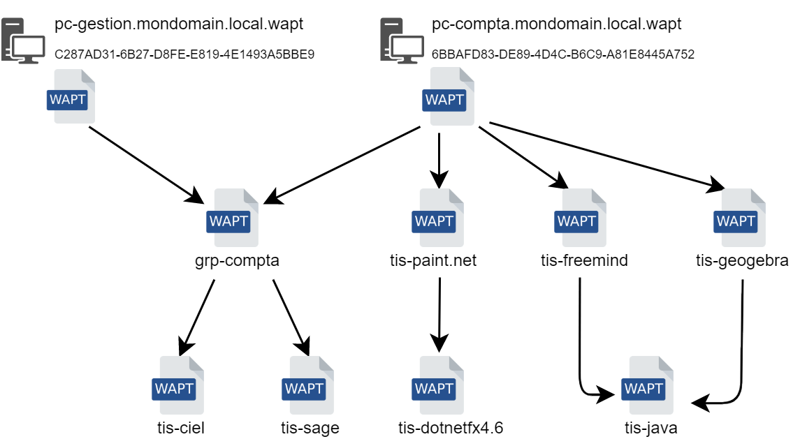
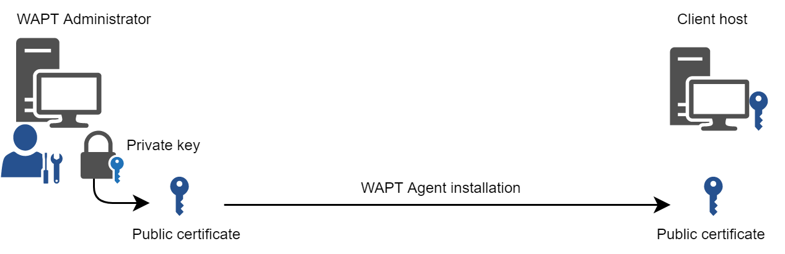
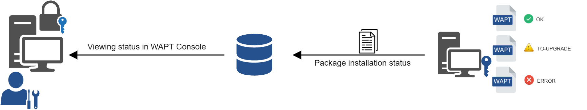
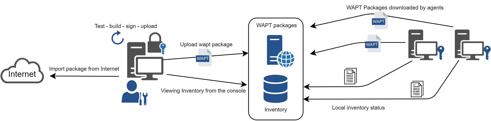
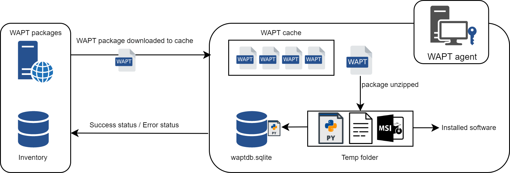
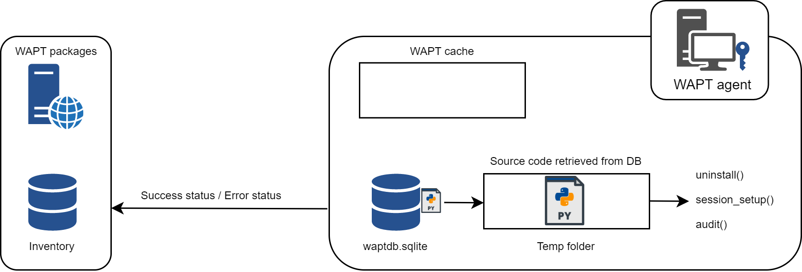

.. Reminder for header structure:
   Niveau 1: ====================
   Niveau 2: --------------------
   Niveau 3: ++++++++++++++++++++
   Niveau 4: """"""""""""""""""""
   Niveau 5: ^^^^^^^^^^^^^^^^^^^^

.. meta::
   :description: Introduction to WAPT
   :keywords: WAPT, Why, How, principles, documentation, history, genesis

.. _wapt_general_presentation:

Introduction to WAPT
====================

For what purpose is WAPT useful?
--------------------------------

**WAPT** installs, updates and removes software and configurations
on Windows devices. Software deployment (Firefox, MS Office, etc.)
can be carried out from a central server using a graphical console.
WAPT is taking many ideas from Debian Linux apt-get package management tool,
hence its name. WAPT **Community** Edition is distributed under
the **GPLv3** license. **Enterprise** Edition is distributed under
a proprietary license.

**WAPT** is intended to help IT administrators manage their deployed base
of computer desktops, laptops, tablets running a Microsoft Windows client
(from XP to 10), their deployed base of Windows servers
(from 2003 to 2019) or their deployed base of Windows Intel tablets.

Private companies of all sizes, Colleges, Schools, Universities, research labs,
local and state governments, Hospitals, city hall,
state ministries are successfully using **WAPT**.

**WAPT** exists in two versions, **Community** and **Enterprise**.

**WAPT** is very efficient to address **recurrent Flash and Java update needs**
and it is often to cover that basic need that WAPT is initially adopted;
it then becomes a tool of choice for the sysadmin's daily tasks.

**If you're a developer, WAPT can help you configure
your development environment on your computer as Chocolatey / NuGet can do.**

The genesis of WAPT
-------------------

Our assessment after 15 years of IT management
++++++++++++++++++++++++++++++++++++++++++++++

Managing large IT installed bases of Microsoft Windows computers
is today a difficult task in a secured environment:

* common ghosting methods (*Clonezilla* or *Ghost*) are efficient on homogeneous
  IT infrastructures with roaming user profiles;

* deployment software (*OCSInventory* or *WPKG*) can broadcast software
  but does not easily allow software level or user level customizations
  that are useful to prevent or limit user support requests;

* software from smaller vendors often need :term:`Local Administrator` rights
  to run properly;

* currently available solutions to address theses 3 problems are either
  too expensive or too inefficient, and they are in every case too complex;

WAPT development hypotheses and motivations
+++++++++++++++++++++++++++++++++++++++++++

The development of WAPT is motivated by these two principles:

* what is **complicated** should be made **simple**;

* what is **simple** should be made **trivial**;

WAPT relies on a small set of fundamental hypotheses:

* sysadmins know script languages and WAPT has chosen Python for the depth
  and breadth of its libraries;

* sysadmins who have little experience with scripting languages
  must find inspiration in simple and efficient examples that they'll adapt
  to fit their needs;

* sysadmins must be able to communicate on the efficiency of their actions
  to their superiors and report process gaps to internal or external auditors;

* sysadmins must be able to collaborate with their IT team in full trust;
  thereby WAPT local repositories provide signed packages they can trust
  to be deployed on their network. Alternatively, they can choose
  external repositories providing them the security guarantees
  they consider sufficient;

* sysadmins are aware that user workstations serve business purposes
  and some customizations must be possible. The adaptation of the infrastructure
  to the business needs is facilitated by the notion of groups; it allows
  to select a large number of machines to customize their configuration;

Fundamental principles
----------------------

Package/ Repository principle
+++++++++++++++++++++++++++++

WAPT packages
"""""""""""""

A WAPT package structure is similar to Debian Linux **.deb** packages.
Each WAPT package includes the binaries to be executed and the other files
it needs.

A package is easily transportable.

Here is how a WAPT package looks:

.. figure:: ../wapt-common-resources/wapt-package-structure.png
  :align: center
  :alt: WAPT package structure

  WAPT package structure

WAPT repositories
"""""""""""""""""

Packages are stored in a web repository. They are not stored in a database.

They are served by the :program:`Nginx` web server,
available with Linux and Windows.

The :file:`Packages` index file is the only thing necessary.
It lists the packages available on allowed repositories
and some basic information on each package.

That mechanism allows to easily set up a replication process between
multiple repositories.

Types of WAPT packages
++++++++++++++++++++++

There are 7 types of WAPT packages:

  Anatomy of a simple WAPT package

*Base* packages
"""""""""""""""

They are classic software packages.

They are stored in the web directory https://srvwapt.mydomain.lan/wapt/.

*Group* packages
""""""""""""""""

They are groups/ bundles of packages.

.. hint::

  * a group / bundle of softwares often corresponds
    to a *host profile* (ex: **accounting**);

  * a group of hosts often corresponds to a room, building, etc;

  * a host can be a member of several groups (ex: one or more hosts profiles
    in the same room in a building);

They are stored in the web directory https://srvwapt.mydomain.lan/wapt/.

*Host* packages
"""""""""""""""

Host packages are named after the :term:`UUID` of the computer BIOS.

Each host will look for its *host* package to know the packages
that it must install (i.e. *dependencies*).

They are stored in the web directory https://srvwapt.mydomain.lan/wapt-host/.

*Unit* packages
"""""""""""""""

.. versionadded:: 1.6 Enterprise

*Unit* packages bear the complete name of :abbr:`OU (Organizational Unit)`,
example: **OU=room1,OU=prod,OU=computers,DC=mydomain,DC=lan**.

By default, each computer looks for the *unit* packages
that the host belongs to:

* OU=room1,OU=prod,OU=computers,DC=mydomain,DC=lan;

* OU=computers,DC=mydomain,DC=lan;

* DC=mydomain,DC=lan;

and then installs the list of associated dependencies.

They are stored in the web directory https://srvwapt.mydomain.lan/wapt-host/.

.. note::

  If the computer is removed from an Organizational Unit,
  obsolete *unit* packages will be removed.

*waptwua* packages
""""""""""""""""""

*waptwua* packages contain the list of authorized or prohibited Windows Updates.

When this package is installed on the endpoint, the next update scan
performed by WAPT will choose Windows updates based on this filtering.

If the host has several *waptwua* packages, then WAPT
will merge all package rules.

When this package is installed on the host, the next :command:`update` will scan
for official Windows updates applicable to the host based on this filtering.

*selfservice* packages
""""""""""""""""""""""

.. versionadded:: 1.7 Enterprise

*selfservice* packages contain a list of groups or users
(Active Directory or local) and their associated lists
of authorized packages that Users are allowed to install by themselves.

*profile* packages
""""""""""""""""""

.. versionadded:: 1.7 Enterprise

*profile* packages are similar to *group* packages.

However, *profile* packages work a little differently and are most useful
when an Active Directory Server is operating within the :term:`Organization`:

* the WAPT agent will list the Active Directory groups where the host belongs;

* if a *profile* package has the same name as the Active Directory group,
  then the WAPT agent will install automatically the *profile* package
  for the Active Directory group of which it is a member;

If the host is no longer a member of its Active Directory group,
then the *profile* package will be uninstalled.

.. note::

   For performance reasons, this feature is enabled only
   if the *use_ad_groups* option is enabled in :file:`wapt-get.ini`.

Dependency mechanism
++++++++++++++++++++

In WAPT everything works on the principle of dependencies.

By default, the WAPT agent will look for its host package. The *host* package
lists packages to install on the computer.

The *host* package is correctly installed when all its dependencies
are satisfied.

Each sub-dependency must be satisfied to satisfy an upper-level dependency.

When every dependency is satisfied, the host notifies its status
to the WAPT Server and its indicator turns **OK** and green in the WAPT console,
meaning the host has the host profile that the :term:`Administrator`
or :term:`Package Deployer` has defined for it.

  Conceptual diagram of the dependency mechanism

.. hint::

  When attributing a software package to a host as a dependency,
  only the software canonical name without its version number is registered
  as a dependency (ex: *I want Freemind to be installed on this machine
  in its latest version and :program:`Freemind` to be configured
  so that the :term:`User` does not call me because she does not find
  the icon on her desktop!*).

For each dependency, the WAPT agent will take care of automatically installing
the latest available package version. So if several versions
of :program:`Freemind` are available on the repository, the WAPT agent
will always get the latest version, unless I have pinned the version
for reason of compatibility with other sets of tools.

Afterwards, when the agent contacts the repository to check for new updates,
it will compare the package versions on the repository with its own local list
of packages already installed on the machine.

If an update of an installed package is available, the client will switch
the status of the package to **NEED UPGRADE**.
It will then install the software updates during the next :command:`upgrade`.

Private key / Public key principle
++++++++++++++++++++++++++++++++++

Introduction
""""""""""""

Like Android **APK** packages, WAPT packages are signed; a hash
of the control sum of all the files included in the package is calculated.

This signing method guarantees the origin and integrity of the package.

Private key / Public key principle
""""""""""""""""""""""""""""""""""

  Private key/ public certificate

To work properly, WAPT requires a private key/ public key pair (self-signed,
issued by an internal :term:`Certificate Authority` or commercially issued).

The **private key** will be used to **sign** WAPT packages whereas
the **public key** will be distributed with every WAPT client so that
WAPT agents may validate the files that were signed with the private key.

The different public keys will be stored in the WAPT subdirectory :file:`ssl`.
That folder can contain several public keys.

Package verification
""""""""""""""""""""

When a WAPT package is downloaded, the WAPT agent (:program:`waptagent`)
will check the integrity of the package, and then check that the package
has been properly **signed**.

If the WAPT package signature does not match any of the public keys located
in :file:`C:\\Program Files (x86)\\wapt\\ssl`, the WAPT agent will refuse
to install the package.

For more information, please refer to the documentation on
:ref:`how the installation process integrity of a WAPT package
is insured <WAPT_package_installation_process_integrity>`.

The private certificate is important
""""""""""""""""""""""""""""""""""""

.. attention::

   The private key must **NOT** be stored on the WAPT Server, nor on any public
   or shared storage that could be accessed by non-authorized personnel.
   Indeed, WAPT security is based on keeping the private key **private**.

   The private key must be stored in a safe place,
   because **she who has your key controls your network**!

   Finally, to ensure maximum security, the private key can be secured
   in a smartcard or a cryptographic token that WAPT :term:`Administrators`
   or :term:`Package Deployer` will carry physically on them,
   using the smartcard or the token only when needed to sign a WAPT package.

.. note::

    From WAPT 1.5 onward, the private key is protected
    with a password by default.

WAPT architecture and operating mode
------------------------------------

Inventory/ information feedback
+++++++++++++++++++++++++++++++

WAPT keeps a hardware and software inventory of each host.

That inventory is stored in a small database integrated in each WAPT agent.

  Inventory feedback mechanism

* when first registering with the WAPT Server, the WAPT agent sends
  the entire inventory (BIOS, hardware, software) to the server;

* when the WAPT agent updates, the WAPT agent will report its inventory status
  to the WAPT Server;

.. figure:: wapt_concept-detailled-inventory.png
  :align: center
  :alt: The inventory in the WAPT console

  The inventory in the WAPT console

The central inventory allows you to filter hosts by their components,
software or any other searchable argument.

Information feedback
""""""""""""""""""""

The WAPT agents also report back their WAPT package status.

  Inventory feedback returned to the WAPT Server

In case of errors during package installation, the information will be reported
to the WAPT Server. The host will then appear in **ERROR** in the console.

.. figure:: wapt_concept-error.png
  :align: center
  :alt: Packages with error status in the WAPT console

  Packages with error status in the WAPT console

The :term:`Administrator` can see the package returned in error in the console
and fix the package accordingly.

For each :command:`upgrade`, WAPT will try to install a new version
of the package until no error status is returned.

.. note::

   From WAPT 1.3.13 onward, WAPT agents sign their inventory before sending
   it to the WAPT Server.

   For more information, please refer to :ref:`signing inventory updates
   <signing_inventory_updates>`.

Complete diagram of the WAPT operating mechanism
++++++++++++++++++++++++++++++++++++++++++++++++

  WAPT general operating mode

We find here the common WAPT behavior, from duplicating a package
from an external repository accessible on the Internet, to deploying it
on network hosts.

Read the diagram clockwise:

* import packages from an external repository (or create a new package
  from scratch);

* test, validate, build and then sign the package;

* upload the package onto the main repository;

* packages are automatically downloaded by WAPT clients;

* packages are executed based on the selected method:

  * The :term:`Administrator` forces the :command:`upgrade`;

  * the :term:`User` chooses the right time for themself;

  * a scheduled task launches the upgrade;

  * the upgrade is executed when the machine shuts down;

* inventory information feedback;

* the updated inventory is reported in the console;

WAPT agent behavior with packages install / remove / session_setup / audit
++++++++++++++++++++++++++++++++++++++++++++++++++++++++++++++++++++++++++

A key concept that can be hard to understand is the behavior of a WAPT agent
when installing a package and the considerations around it.

WAPT agent package installation can be split in SSS steps:

* package downloaded in agent cache;

* package unzip to temp folder;

* :file:`setup.py` content is stored in WAPT agent database located
  in :file:`C:\\Program Files (x86)\\wapt\\db\\waptdb.sqlite`;

* software installed from unzipped files:

* in case of success: downloaded package + unzipped files
  are deleted and status is sent to server;

* in case of failure: downloaded package is kept - unzipped files
  are deleted - error status sent to server;

That behavior is important as it has an impact on further actions.

  WAPT install behavior

For instance when removing a package the following steps are taken:

* :file:`setup.py` content is retrieved from WAPT agent database located
  in :file:`C:\\Program Files (x86)\\wapt\\db\\waptdb.sqlite`;

* software uninstall from registry :command:`UninstallString` is executed;

* if defined, :command:`uninstall()` function is executed
  from retrieved package source code;

Similar steps are reproduced when executing :command:`session_setup`
and :command:`audit`.

  WAPT behavior with uninstall / session_setup and audit

WAPT Server architecture
++++++++++++++++++++++++

The WAPT Server architecture relies on several distinct roles:

* the *repository role* for distributing packages;

* the *inventory* and *central server* role for hardware and software inventory;

* the *proxy* role to relay actions between the WAPT console
  and the WAPT agents;

Repository role
"""""""""""""""

First, the WAPT Server serves as a web repository.

  WAPT repository mechanism

* the repository role is accomplished by a :program:`Nginx` web server;

* the repository allows the distribution of WAPT packages, the installers
  for :program:`waptagent` and :program:`waptsetup`;

* WAPT packages are available via a web browser
  by visiting https://srvwapt.mydomain.lan/wapt;

* *host* packages are stored in a directory that is not accessible
  by default (https://srvwapt.mydomain.lan/wapt/wapt-host/);

Inventory server role
"""""""""""""""""""""
Second, the WAPT Server serves as an inventory server.

The inventory server is a passive service that collects information reported
by WAPT agents:

* hardware inventory;

* software inventory;

* WAPT packages status;

* tasks status (*running*, *pending*, *error*);

.. note::

  The WAPT service is not active in the sense that it only receives information
  from clients. As a consequence, if the inventory server fails,
  the inventory will recover by itself from inventory status reports received
  from the deployed WAPT agents.

  In the Community version of WAPT, access to inventory data is only possible
  through the WAPT console.

  WAPT **Enterprise** 1.7 will come with a *Business Intelligence*
  like web based reporting.

Proxy role
""""""""""

Third, the WAPT Server serves as a command relay proxy.

It acts as a relay between the WAPT management console and deployed WAPT agents.

  WAPT proxy mechanism

.. note::

  Every action triggered on a WAPT agent from the server are signed
  with the :term:`Administrator`'s private key. Without a valid private key,
  it is not possible to trigger remote actions on remote WAPT equipped devices.
  For more information on remote actions, please refer to :ref:`signing actions
  relayed to the WAPT agents <signing_actions_relayed_to_WAPT_agents>`.

WAPT common interactions
++++++++++++++++++++++++

update
""""""

When an :command:`update` command is launched on an agent (from the console,
via the command-line or via the WAPT tray), it is equivalent to ordering
the agent to check the WAPT repository for new packages. By default,
the WAPT agent will look for updates every two hours.

If the date of the :file:`Packages` index file has changed since the last
:command:`update`, then the WAPT agent downloads the new :file:`Packages` file
(between 20 and 100k), otherwise, it does nothing.

The WAPT agent then compares the :file:`Packages` file with
its own local database.

If the WAPT agent detects that a package must be added or updated,
it will switch the status of the host and package to *NEED-UPGRADE*.

It will not launch the installation of the package immediately.
The WAPT agent will wait for an ":command:`upgrade`"
order to launch the upgrade.

upgrade
"""""""

When we launch a command :command:`upgrade` (from the WAPT console,
using the command line, with a Windows scheduled task or manually
with the WAPT tray), we ask the WAPT agent to install the packages
with a *NEED-UPGRADE* status.

An :command:`update` must come before an :command:`upgrade`,
otherwise the agent will not know whether updates are available.

Working principle of the WAPT agent
+++++++++++++++++++++++++++++++++++

By default, the WAPT agent will trigger an :command:`update`/ a
:command:`download-upgrade` at startup; after starting up, the WAPT agent
will check every 2 hours to see whether it has something to do.

Packages to be installed will be downloaded and cached in the folder
:file:`C:\\Program Files (x86)\\wapt\\cache`.

:program:`waptexit` will launch an :command:`upgrade` when the computer
shuts down. An :term:`Administrator` will also be able to launch
an :command:`upgrade` from the WAPT console.

If the WAPT Server is not reachable when upgrading, the WAPT agent will still
be able to install cached packages.

Inventory updates will then be sent to the WAPT Server
when network connectivity returns.

The 4 goals of the WAPT agent are therefore:

* to install a *base*, a *group* or a *unit* package if it is available;

* to remove obsolete packages;

* to resolve package dependencies and conflicts;

* to make sure all installed WAPT packages are up to date compared to the ones
  stored on the repository;

* to regularly update the WAPT server with its hardware status and the status
  of installed software;

WAPT package creation
---------------------

WAPT language and development environment
+++++++++++++++++++++++++++++++++++++++++

WAPT is built using the `Python language <https://www.python.org>`_.

Any Rapid Application Development environment intended for Python development
is suitable.

Tranquil IT has developed some useful WAPT specific plugins
for the :program:`PyScripter` IDE (https://sourceforge.net/projects/pyscripter).

Tranquil IT recommends using :program:`PyScripter`, available
with the *tis-waptdev* meta-package.

Principles of WAPT package development
++++++++++++++++++++++++++++++++++++++

The strength of Python
""""""""""""""""""""""

All the power of :program:`Python` can be advantageously put to use.

Many libraries already exist in Python for:

* doing conditional loops (if ... then ... else ...);

* copying, pasting, moving files and directories;

* checking whether files or directories exist;

* checking whether registry keys exist;

* checking access rights, modifying access rights;

* looking up information on external data sources (LDAP, databases, files, etc);

* etc ...

The power of WAPT
"""""""""""""""""

Functions most commonly used with WAPT were simplified within libraries
called :term:`SetupHelpers`.

**SetupHelpers** libraries simplify the process of creating and testing
WAPT packages, thus validating WAPT's main objectives:

* **what was complicated is made simple**;

* **what was simple is made trivial**;

Now, I want to :ref:`install my WAPT Server <installing_WAPT_Server>`!!
