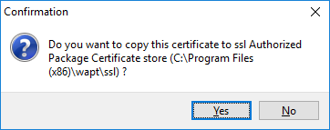
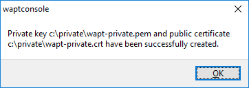

.. Reminder for header structure :
   Niveau 1 : ====================
   Niveau 2 : --------------------
   Niveau 3 : ++++++++++++++++++++
   Niveau 4 : """"""""""""""""""""
   Niveau 5 : ^^^^^^^^^^^^^^^^^^^^

.. meta::
  :description: Generating the Administrator's certificate
                for signing WAPT packages
  :keywords: wapt-private.pem, wapt-private.crt, signer, certificate
             documentation

.. _create_certificate:

Generating the Administrator's certificate for signing WAPT packages
====================================================================

Introduction
------------

Naming conventions
++++++++++++++++++

  * name of the private key: :file:`wapt-private.pem`;

  * public certificate signed with private key: :file:`wapt-private.crt`;

Private key *wapt-private.pem*
++++++++++++++++++++++++++++++

.. attention::

  The :file:`wapt-private.pem` file is fundamental for security.
  It must be stored in a safe place and correctly protected.

The :file:`wapt-private.pem` file is the private key, it is located by default
in the :file:`C:\private` folder of the :term:`Administrator` workstation.

For better security this private key may be transfered on an external storage.
A smartcard support is in the roadmap.

This private key will be used along with the certificate to sign packages
before uploading them onto the WAPT repository.

public certificate signed with private key: :file:`wapt-private.crt`
++++++++++++++++++++++++++++++++++++++++++++++++++++++++++++++++++++

The :file:`wapt-private.crt` file is the public certificate that is used
along with the private key. It is by default created in the :file:`C:\private`
folder, copied in :file:`C:\Program Files (x86)\wapt\ssl` of the Administrator
and deployed on the desktops managed by the Administrator
via WAPT agent or a GPO.

This certificate is used to validate the signature of packages
before installation.

Creating a certificate
----------------------

In the WAPT console go to :menuselection:`Tools --> Create a certificate`;

.. figure:: wapt_certificate-menu-create-certificate.png
  :align: center
  :alt: Creating a self-signed certificate

  Creating a self-signed certificate

.. important::

  We have two different options:

    * :ref:`create a certificate for the Community version
      <create_certificate_community>`;

    * :ref:`create a certificate for the Enterprise version
      <create_certificate_enterprise>`;

.. _create_certificate_community:

Creating a certificate - WAPT Community
+++++++++++++++++++++++++++++++++++++++

* fill in the following fields:

.. figure:: wapt_certificate-generate-certificate.png
  :align: center
  :alt: Creating a self-signed certificate

  Creating a self-signed certificate

* click on :guilabel:`OK` to go on to the next step;

Required informations are:

* :guilabel:`Destination folder`: folder where the private key
  and the public certificate will be stored: **required**;

* :guilabel:`Name of the private key`: name of the :file:`.pem`
  and :guilabel:`Name of the private key`;

* :guilabel:`Private key password`: password for locking
  and unlocking the key: **required**;

* :guilabel:`Private key password`: password for locking
  and unlocking the key: **required**;

* :guilabel:`Common Name (CN)`: name of the Administrator: **required**;

* :guilabel:`Certificate name`: name of the
  :file:`.crt` certificate: **required**;

* :guilabel:`Additional informations`: additional details stored
  in the private key. These informations will help with identifying
  the origin of the WAPT package: **optional**;

For a fresh install, you can follow the screenshot below.

.. hint::

  The password complexity must comply with your :term:`Organization`'s security
  requirements (eg. :term:`ANSSI` passwords recommendations).

.. danger::

  * the path to your private key must not be in the installation path of WAPT
    (:file:`C:\Program Files (x86)\wapt`);

  * if your key is stored in :file:`C:\Program Files (x86)\wapt\`,
    your :term:`Administrator` private key will be deployed on your clients,
    **absolutely a no go!**

  Confirmation of the copy of the certificate in the ssl folder

* click on :guilabel:`Yes` to copy the newly generated certificate
  in the :file:`C:\Program Files (x86)\wapt\ssl` folder.
  This certificate will be picked up during the compilation of the WAPT agent
  and deployed on the client computers.

If everything has gone well the following message will appear:

  Certificate generated successfully

* click on :guilabel:`OK` to go on to the next step;

You may go on to the next step and :ref:`configure your WAPT console
<wapt_console_config>`!!

.. _create_certificate_enterprise:

Creating a certificate - WAPT Enterprise
++++++++++++++++++++++++++++++++++++++++

With WAPT Enterprise, you can create a Master key with a Certificate Authority
flag that can both sign packages and sign new certificates.

.. hint::

  In order to create new signed certificates for delegated,
  please refer to :ref:`new_crt_with_ca`.

.. figure:: wapt_certificate-generate-certificate.png
  :align: center
  :alt: Creating a self-signed certificate

  Creating a self-signed certificate

Required informations are:

* :guilabel:`Destination folder`: folder where the private key
  and the public certificate will be stored: **required**;

* :guilabel:`Name of the private key`: name of the :file:`.pem`
  and :guilabel:`Name of the private key`: name of the :file:`.pem`
  and :file:`.crt` files: **required**;

* :guilabel:`Private key password`: password for locking
  and unlocking the key: **required**;

* :guilabel:`Common Name (CN)`: name of the Administrator: **required**;

* :guilabel:`Certificate name`: name of
  the :file:`.crt` certificate: **required**;

* :guilabel:`Code signing`: check this box if the certificate/ key pair
  will be allowed to sign software packages: **required**;

* :guilabel:`CA certificate`: check this box if this certificate can be used
  to sign other certificates (main or intermediate Certificate
  Authority): **required**;

* :guilabel:`Additional informations`: additional details stored
  in the private key. These informations will help with identifying
  the origin of the WAPT package: **optional**;

.. hint::

  The password complexity must comply with your :term:`Organization`'s security
  requirements (eg. :term:`ANSSI` passwords recommendations).

.. note::

  If your Organization is already equipped with an :term:`Certificate Authority`
  (CA), you will have to fill the certificate and the key in the fields
  :guilabel:`CA Certificate` et :guilabel:`CA Key`.

  With this procedure you can generate new certificate/ key pairs
  with or without **Code Signing** capability.

.. danger::

  * the path to your private key must not be in the installation path
    of WAPT (:file:`C:\Program Files (x86)\wapt` );

  * if your key is stored in :file:`C:\Program Files (x86)\wapt` ,
    your Administrator private key will be deployed on your clients,
    **absolutely a no go!**

  Confirmation of the copy of the certificate in the ssl folder

* click on :guilabel:`Yes` to copy the newly generated certificate
  in the :file:`C:\Program Files (x86)\wapt\ssl` folder.
  This certificate will be picked up during the compilation of the WAPT agent
  and deployed on the client computers;

If everything has gone well the following message will appear:

  Certificate generated successfully

* click on :guilabel:`OK` to go on to the next step;

You may go on to the next step and :ref:`configure your WAPT console
<wapt_console_config>`.
