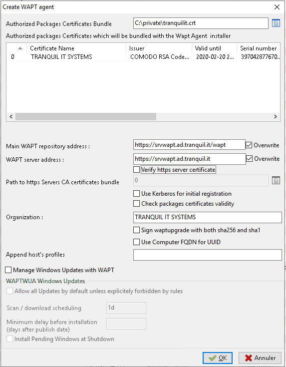
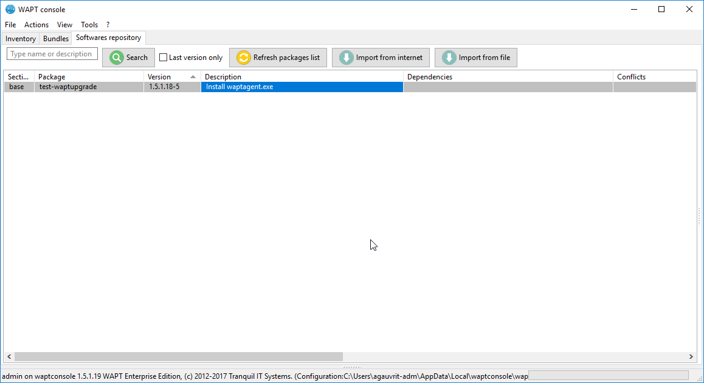

.. Reminder for header structure :
   Niveau 1 : ====================
   Niveau 2 : --------------------
   Niveau 3 : ++++++++++++++++++++
   Niveau 4 : """"""""""""""""""""
   Niveau 5 : ^^^^^^^^^^^^^^^^^^^^

.. meta::
    :description: Building the WAPT agent installer
    :keywords: waptagent.exe, installeur, InnoSetup, documentation, WAPT

.. _create_WAPT_agent:

WAPT agent installer
=================================

Choice of the unique identification mode of the wapt agents
------------------------------------------------------------

In wapt you can choose the unique identification mode of the agents.

When a wapt agent registers the server must know if it is a new machine or if it is a machine already registered.

For this, the wapt server looks at the unique number "UUID" sent in the inventory

Wapt offers 3 modes of operation, it's up to you to choose the mode that suits you

.. attention::

   When choosing a mode of operation it is difficult to change it, think carefully!

Identification by UUID number BIOS (serial number)
++++++++++++++++++++++++++++++++++++++++++++++++++++++++++++++++++++++++++++++++

This mode of operation makes it possible to identify the machines in the console in a physical manner. 

If you replace a computer and give the new computer the same name as the previous one, you will have two computers that will appear in the wapt console since you have two computers physically.

.. note::

   Some vendors do not work properly and assign the same UUID bios to two different computers. In this case, wapt only sees one computer ...

Identification by machine name
++++++++++++++++++++++++++++++++++++++++++++++++++++++++++++++++++++++++++++++++

This mode of operation is similar to that of the active directory. The machines are identify by name.

.. note::

   This mode does not work if some machine in your park has the same name.
   
Identification by installation of wapt.
++++++++++++++++++++++++++++++++++++++++++++++++++++++++++++++++++++++++++++++++

This mode of operation allows PCs to be identified by their wapt installation. Each installation of wapt generates a unique random number.
If you uninstall wapt and then reinstall it, you will see a new pc appear in the console.
   

Building the WAPT agent installer
------------------------------------------------------------

The :program:`waptagent` binary is an InnoSetup installer.

Once the WAPT console has been installed on the :term:`Administrator` computer,
we have all files required to build the WAPT agent installer.

* files that will be used during building of the WAPT agent are located
  in :file:`C:\\Program Files (x86)\\wapt`;

* installer source files (:file:`.iss` files) are located
  in :file:`C:\\Program Files (x86)\\wapt\\waptsetup`;

.. hint::

  Before building the WAPT agent, please verify the public certificate(s)
  in :file:`C:\\Program Files (x86)\\wapt\\ssl`.

  If you wish to deploy other public certificates on your :term:`Organization`'s
  computers that are equipped with WAPT, you will have
  to copy them in that folder.

.. danger::

  **DO NOT COPY the private key** of any :term:`Administrator`
  in :file:`C:\\Program Files (x86)\\wapt`.

  This folder is used when building the WAPT agent and the private keys
  would then be deployed on all the computers.

* In the WAPT console, go to :menuselection:`Tools --> Build the WAPT agent`.

.. figure:: waptagent-menu_generate_waptagent.png
  :align: center
  :alt: Generate the WAPT agent from the console

  Generate the WAPT agent from the console

* fill in the informations that are necessary for the installer:

  * the field :guilabel:`Public certificate`: **required**;

    example : :file:`C:\\private\\mydomain.crt`

  * the field :guilabel:`Address of the WAPT repository`: **required**;

    example : https://srvwapt.mydomain.lan/wapt

  * the field :guilabel:`Address of the WAPT Server`: **required**;

    example : https://srvwapt.mydomain.lan

  * the checkbox :guilabel:`Verify the WAPT Server HTTPS certificate`;

  * the field :guilabel:`Path to the bundle of certificates` to verify
    the HTTPS certificate of the WAPT Server;

  * the checkbox :guilabel:`Use Kerberos for registering WAPT agents`;

  * the field :guilabel:`Organization` to identify the origin of WAPT packages;

  * the field :guilabel:`Sign waptupgrade with both sha256 and sha1` can be ignored because it is only useful when upgrading from version 1.3 ;
  
  * the field :guilabel:`Use computer FQDN for UUID`  and :guilabel:`Use random host UUID (for buggy BIOS)`  (see explanation in the previous paragraph of this documentation.)
  
  * the field :guilabel:`Enable AD Groups` Enable the installation of profile packages based on the active directory groups of which the machine is a member. **This feature can degrade the performance of wapt**

  * the field :guilabel:`Append host's profiles`  Allows to define a list of wapt packages to install obligatorily.
  
  * the field :guilabel:`Automatic periodic packages audit scheduling`  Define the frequency where the agent checks if he has audits to perform. 
  
  * Windows update section, go to the windows update agent part of the documentation for more information on this topic.
  
.. danger::

   * The checkbox **Use Kerberos for the initial registration** must be checked
     **ONLY IF** you have followed the documentation
     on **Configuring the Kerberos authentication**.
   
   * The checkbox **Verify the WAPT Server HTTPS certificate**must be checked
     **ONLY IF** you have followed the documentation
     on **Activating the verification of the SSL / TLS certificate**.

  Fill in the informations on your Organisation
  

* provide the password for unlocking the private key:

.. figure:: ../../wapt-common-resources/enter-certificate-password.png
  :align: center
  :alt: Provide the password for unlocking the private key

  Provide the password for unlocking the private key

  Progression of WAPT agent installer building

Once the WAPT agent installer has finished building, a confirmation dialog
pops up indicating that the :program:`waptagent` binary
has been successfully uploaded to https://srvwapt/wapt/.

.. figure:: waptagent-successfully-uploaded.png
  :align: center
  :alt: Confirmation of the WAPT agent loading onto WAPT repository

  Confirmation of the WAPT agent loading onto WAPT repository

.. note::

  A warning shows up indicating that the GPO hash value should be changed.
  GPOs may be used to deploy the WAPT agent on your Organization's computer.

Package *test-waptupgrade*
""""""""""""""""""""""""""""""

The ``test-waptupgrade`` package has also been uploaded on the repository.

The ``test-waptupgrade`` package contains the WAPT agent with arguments
specified during the installation of WAPT on your Administrator's computer.

  New WAPT agent in the repository

.. note::

  This package is a standard WAPT package designed
  to upgrade WAPT agents on client machines.
