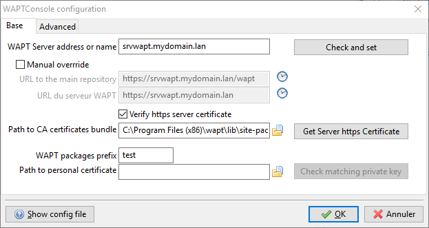

.. Reminder for header structure :
   Niveau 1 : ====================
   Niveau 2 : --------------------
   Niveau 3 : ++++++++++++++++++++
   Niveau 4 : """"""""""""""""""""
   Niveau 5 : ^^^^^^^^^^^^^^^^^^^^

.. meta::
  :description: Configuring the WAPT console
  :keywords: waptconsole.exe, console, WAPT, installation,
             preferences, management, documentation,

.. _wapt_console_config:

Configuring the WAPT console
============================

We will now properly configure the WAPT console.

Go to console configuration settings: :menuselection:`Tools --> Preferences`.

.. figure:: waptconsole-preference-menu.png
  :align: center
  :alt: WAPT console preferences menu

  WAPT console preferences menu

WAPT console preferences
++++++++++++++++++++++++

Here we will set the prefix.

.. attention::

  **It is not trivial to change the prefix later as it would require
  re-signing all packages in all repositories, so choose your prefix well
  the first time!**

  Configuring the WAPT console

The path to the private key has been automatically entered when we generated
the private key in the previous step.

If you already have a key (ex: from a previous installation),
you'll have to fill your old key here.

If you want to learn more on setting up the WAPT console, you may visit
the documentation on :ref:`configuring the WAPT console
<configuring_the_WAPT_console>`.

You may now go on to :ref:`create the WAPT agent <create_WAPT_agent>`!!
