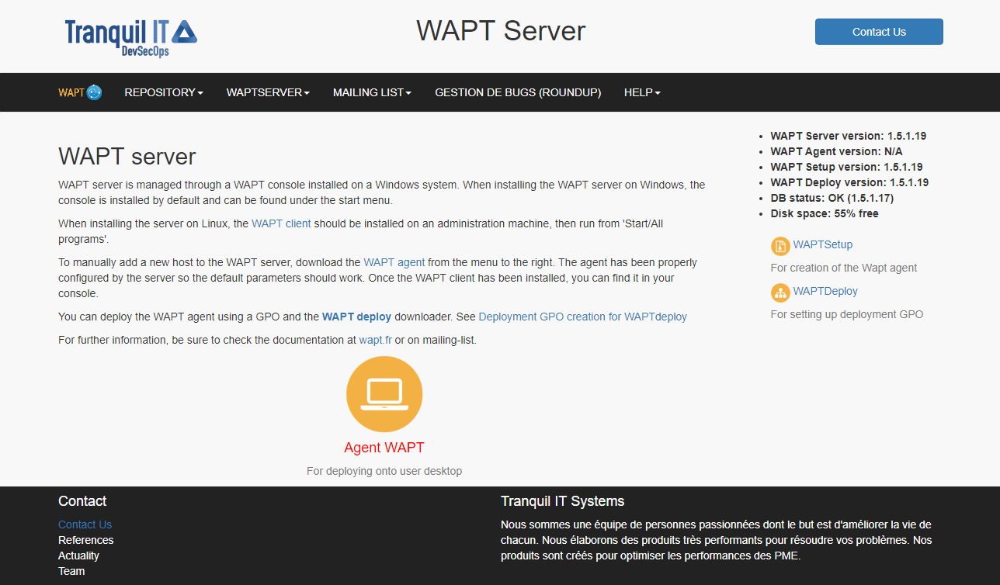
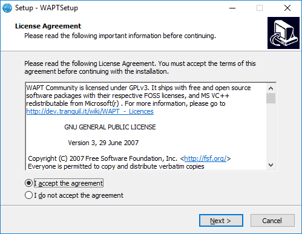
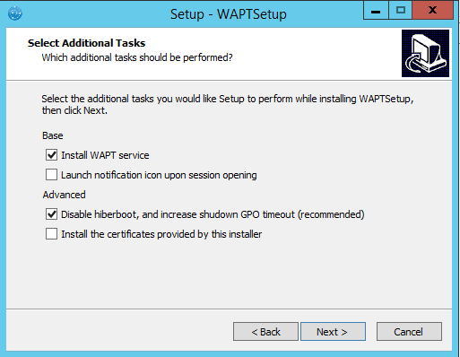
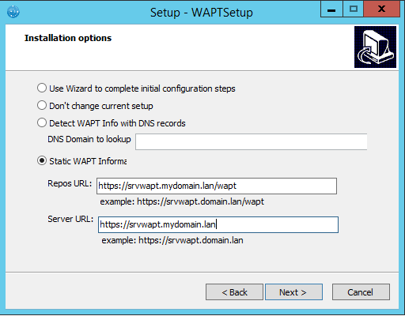

.. Reminder for header structure :
   Niveau 1 : ====================
   Niveau 2 : --------------------
   Niveau 3 : ++++++++++++++++++++
   Niveau 4 : """"""""""""""""""""
   Niveau 5 : ^^^^^^^^^^^^^^^^^^^^

.. meta::
  :description: Installing the WAPT management console
  :keywords: waptconsole.exe, console, WAPT, installation, preferences,
             management, documentation

.. _installing_the_WAPT_console:

Installing the WAPT management console
======================================

.. note::

  * managing WAPT is done mainly via the WAPT console installed
    on the :term:`Administrator`'s workstation;

  * the Administrator's computer must be joined
    to the :term:`Organization`'s Active Directory;

  * the host name of the Administrator's workstation must not be longer
    than 15 characters. This is a limit of sAMAccountName attribute
    in Active Directory;

  * the Administrator's computer will become critical for WAPT
    administration and WAPT package testing;

  * if DNS records are properly configured, you should be able
    to access the WAPT web interface by visiting: https://srvwapt.mydomain.lan;

Downloading and launching the installation of the WAPT console on the Administrator's computer
----------------------------------------------------------------------------------------------

.. attention::

  Warning, the WAPT console **MUST NOT** be installed
  on your Windows based WAPT Server.

  The WAPT console must be installed on the workstation from which
  you manage your network.

  WAPT Server web interface

* if DNS records are properly configured, you should be able
  to access the WAPT web interface by visiting: https://srvwapt.mydomain.lan;

* click on :guilabel:`WAPTSetup` link on the right-hand side
  of the WAPT Server web page;

* start the executable installer as :term:`Local Administrator`
  on the :term:`Administrator`'s workstation;

* choose the language and click on :guilabel:`OK` to install the WAPT console;

.. figure:: waptconsole-choose-language.png
  :align: center
  :alt: Choose the language for WAPT

  Choose the language for WAPT

* click on :guilabel:`OK` to go on to the next step;

  Accept the WAPT license terms

* accept the licence terms and click on :guilabel:`Next` to go to next step;

* choose the WAPT destination folder
  (:file:`C:\\Program Files (x86)\\wapt` by default);

.. figure:: waptconsole-installation-folder.png
  :align: center
  :alt: Choose the WAPT destination folder

  Choose the WAPT destination folder

* click on :guilabel:`Next` and choose your installation options
  (default value should be right for most installations);

  Choose the installer's options

.. note::

  * check :guilabel:`Install WAPT service` if you want to have the WAPT service
    running on your :term:`Administrator` workstation;

  * check :guilabel:`Launch notification tray upon session opening`
    if you want to have the WAPT icon running in the tray by default;

Setting up the WAPT Server URL
------------------------------

.. hint::

  Here, two choices become available to you, you may choose to be guided
  by the configuration wizard and go directly to :ref:`using_the_WAPT_console`,
  or you may choose to continue manually with the configuration.

  Choose the WAPT repository and server

.. note::

  Example:

  * WAPT repository URL: http://srvwapt.mydomain.lan/wapt

  * WAPT Server URL: https://srvwapt.mydomain.lan

* choose the language and click on :guilabel:`OK` to install the WAPT console;

* click :guilabel:`Next` and then :guilabel:`Install`
  to launch the installation, wait for the installation to complete,
  then click on :guilabel:`Finish` (leave default options);

.. figure:: waptconsole-installation-wizard-completed.png
  :align: center
  :alt: Installation Wizard has finished

  Installation Wizard has finished

.. note::

  * check :guilabel:`Register this computer onto WAPT server`
    to register the computer with the WAPT Server;

  * check :guilabel:`Update the list of available package
    on the main repository` to download the list of available packages
    from the WAPT repository;

.. _starting-waptconsole:

Starting the WAPT console
-------------------------

* launch the WAPT console by looking for the binary
  :file:`C:\\Program Files (x86)\\wapt\\waptconsole.exe`

* on first start, you must start the WAPT console with elevated privileges.
  :menuselection:`Right-click on the WAPT console binary
  --> Start as Local Administrator`;

* log into the WAPT console with the :term:`SuperAdmin` login and password;

.. figure:: waptconsole-authentification.png
  :align: center
  :alt: WAPT Server connexion form

  WAPT Server connexion form

if you have any issue logging into the WAPT console,
please refer to the FAQ: :ref:`msg_error_open`;

.. note::

  A message may appear indicating that your WAPT agent version
  is obsolete or not yet present.

.. figure:: waptconsole-waptagent-version-mismatch.png
  :align: center
  :alt: Mismatch error between the versions of the console and that of the agent

  Mismatch error between the versions of the console and that of the agent

Go to the next step to :ref:`create your certificate <create_certificate>`!!
