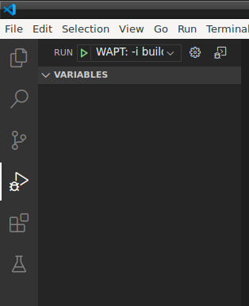

.. Reminder for header structure:
   Niveau 1: ====================
   Niveau 2: --------------------
   Niveau 3: ++++++++++++++++++++
   Niveau 4: """"""""""""""""""""
   Niveau 5: ^^^^^^^^^^^^^^^^^^^^

.. meta::
    :description: Packaging simple Linux packages
    :keywords: linux, WAPT, package, documentation

.. _linux_packaging:

Packaging simple Linux packages
===============================

Before starting, we assume several conditions:

* you have a graphical interface on your Linux system;

* you have installed the :program:`vscode` package
  from the Tranquil IT repository;

* your user is named *linuxuser* and is a member of the *sudoers* group;

create a base template from you linux computer
----------------------------------------------

* start up a Command Line utility;

* as *linuxuser*, create a WAPT package template;

  .. code-block:: bash

    wapt-get make-template <template_name>

  .. warning::

	  Do not launch this command as root or with sudo.

  When you create a template, there will be several files
  in the folder :file:`.vscode` inside your package folder:

  * settings.json;

  * launch.json;

  Example with VLC:

  .. code-block:: bash

    wapt-get make-template "tis-vlc"

    Using config file: /opt/wapt/wapt-get.ini
    Template created. You can build the WAPT package by launching
    /opt/wapt//wapt-get.py build-package /home/linuxuser/waptdev/tis-vlc-wapt
    You can build and upload the WAPT package by launching
    /opt/wapt//wapt-get.py build-upload /home/linuxuser/waptdev/tis-vlc-wapt

  .. hint::

    All packages are stored in linuxuser's home.

 VSCode loads up and opens package project.

  .. figure:: vscode_vlc.png
    :align: center
    :alt: VSCode opening with focus on the *setup* file

    VSCode opening with focus on the *setup* file

* check the :file:`control` file content;

  You have to give a **description** to you package, give the **os_target**
  and the **version** of you package.

  .. hint::

  	**os_target** for unix is *linux*

  .. warning::

    *version* in you :file:`control` file must start at 0,
    not the version number of the software, we don't know precisely
    from apt/yum repo which version will be.

  Original *control* file

  .. literalinclude:: control_origin.txt
    :emphasize-lines: 2

  Modified *control* file

  .. literalinclude:: control_modified.txt
    :emphasize-lines: 2,6,7

  .. note::

    It is to be noted that a sub-version *-1* has been added.
    It is the packaging version of WAPT package.

    It allows the Package Developer to release several WAPT package versions
    of the same software.

* make changes to the code in the :file:`setup.py` file accordingly;

  .. code-block:: python

    :emphasize-lines: 8
    # -*- coding: utf-8 -*-
    from setuphelpers import *

    uninstallkey = []

    def install():
        apt_install('vlc')

* save the package;

Managing the uninstallation
---------------------------

* make changes to the :file:`setup.py` file with an uninstall ;

 .. code-block:: python

   def uninstall():
   apt_remove('vlc')

* launch a :guilabel:`remove` from VSCode :guilabel:`Run Configurations`;

  .. image:: remove_package-linux.png
    :align: center
    :alt: After uninstallation, the software is correctly removed

* check that the software has been correctly removed

 .. code-block:: bash

    dpkg -l | grep vlc

.. hint::

  In the :command:`uninstall()` function, it is not possible to call for files
  included inside the WAPT package. To call files from the package,
  it is necessary to copy/ paste the files in a temporary directory
  during package installation.

Managing the session-setup
--------------------------

* make changes to the :file:`setup.py` file with an session-setup ;

  In this example, you'll need a :file:`vlcrc` file in your package
  to copy in home user. ``ensure_dir`` function and ``filecopyto``
  are from **setuphelpers**, the first one will test if the path exists,
  the second one will copy your file from the WAPT package to its destination.

  .. code-block:: python

    def session-setup():
      vlcdir = os.path.join(os.environ['HOME'], '.config', 'vlc')
      ensure_dir(vlcdir)
      filecopyto('vlcrc',vlcdir)

* launch a :guilabel:`session-setup` from VSCode :guilabel:`Run Configurations`;

  .. image:: remove_package-linux.png
    :align: center
    :alt: After uninstallation, the software is correctly removed

Build and upload the package
----------------------------

Once the installation and the de-installation are configured and tested
and the package is customized to your satisfaction, you may build and upload
your new WAPT package onto your WAPT repository.

If you have built packages on a different machine (ex: Windows
for building your Windows WAPT packages), you have to copy your :mimetype:`.pem`
and :mimetype:`.crt` keys on your Linux machine with :program:`WinSCP`
or equivalent. Usually, this certificate bundle will be located
in :file:`C:\\private` on your Windows computer.
Then, provide the path to the certificates in :file:`/opt/wapt/wapt-get.ini`.

.. code-block:: bash

  sudo vim /opt/wapt/wapt-get.ini

* provide the path to your certificate;

.. code-block:: bash

  personnal_certificate_path=/opt/wapt/private/mykey.crt

* then launch a :command:`build-upload` from VSCode :guilabel:`Run Configurations`;

* provide the password to your private key then admin/password
  of your *waptconsole*;

Your package is now uploaded and available in your private repository
on your WAPT server.
