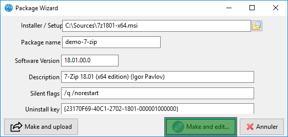
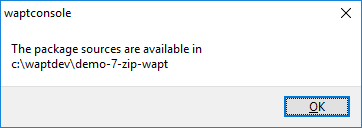
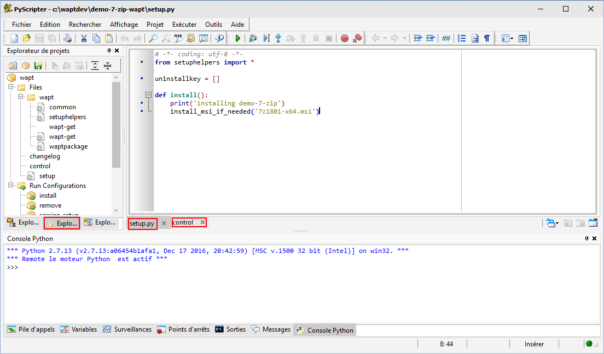
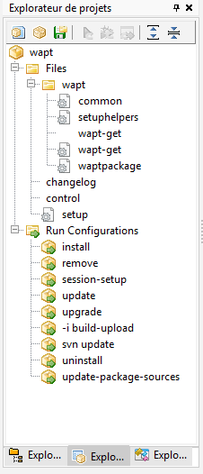
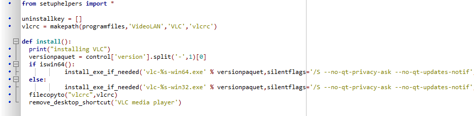
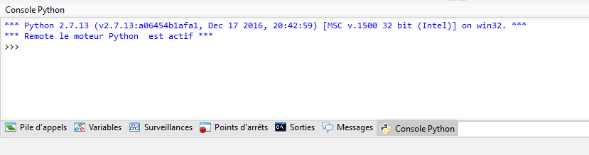
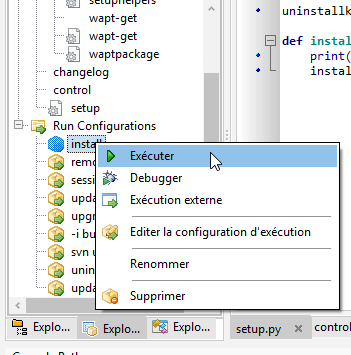
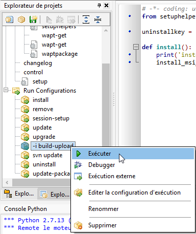
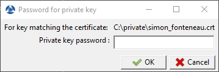
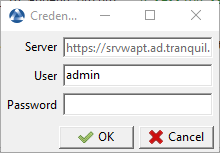

.. Reminder for header structure:
   Niveau 1: ====================
   Niveau 2: --------------------
   Niveau 3: ++++++++++++++++++++
   Niveau 4: """"""""""""""""""""
   Niveau 5: ^^^^^^^^^^^^^^^^^^^^

.. meta::
  :description: Creating a package template from the WAPT console
  :keywords: msi, WAPT, advanced, complex, console, installing, installation,
             documentation

.. _creation_paquets_console:

Creating a package template from the WAPT console
=================================================

.. versionadded:: 1.3.12

.. hint::

  To create WAPT packages directly from the WAPT console, it is necessary
  to have installed the WAPT development environment *tis-waptdev*.

Creating a package template from the WAPT console
-------------------------------------------------

In that example, we use the 7-zip MSI setup downloaded
from the 7-zip official website.

* download the 7-zip MSI installer:

  * `download 7-zip MSI x64 <https://www.7-zip.org/a/7z1604-x64.msi>`_;

  * `download 7-zip MSI x86 <https://www.7-zip.org/a/7z1604.msi>`_;

* create a WAPT package Template from the installer;

  In the WAPT console, click on :menuselection:`Tools -->
  Make package template from setup file`

  .. figure:: tools_make_package_template.png
    :align: center
    :alt: Pyscripter - WAPT console window for creating a package template

    Pyscripter - WAPT console window for creating a package template

  Select the downloaded MSI setup file and fill in the required fields.
  Verify that the package name does not contains any version number.

  .. figure:: package_wizard.png
    :align: center
    :alt: Informations required for creating the package

    Informations required for creating the package

* Two solutions are available:

  * click on :guilabel:`Make and edit ....` (recommended) to launch package customization;

  * click on :guilabel:`Build and upload` to directly build and upload
    the package.

  .. attention::

    The button :guilabel:`Build and upload` directly uploads the package
    into the private repository without testing.

    This method works relatively well with MSI installers
    because their installation is more standardized.

    However, the second method that consists of first testing locally
    the package before uploading is the recommended method.

Customize the package before build-upload
-----------------------------------------

Before uploading a package to your WAPT repository, you may choose to customize
its behavior to your Organization's needs by editing it with
:program:`PyScripter`.

When creating the package template, click on :guilabel:`Make and edit ....`.

  PyScripter - Informations required for creating the package

  PyScripter - The package has been created

The :program:`PyScripter` IDE allows to edit files in the WAPT package.

  PyScripter - Customizing a package with Pyscripter

Presentation of Pyscripter
++++++++++++++++++++++++++

PyScripter project explorer
"""""""""""""""""""""""""""

  PyScripter - project explorer

The PyScripter project explorer lists the different files that you might need,
notably the :file:`control` file and the :file:`setup.py` file.

Run Configurations
""""""""""""""""""

.. figure:: run_configuration.png
  :align: center
  :alt: PyScripter - Run commands in the PyScripter project explorer

  PyScripter - Run commands in the PyScripter project explorer

The :command:`Run` option in the project explorer of:program:`PyScripter`
will allow you to launch actions on the packages that you are editing.

Editor panel
""""""""""""

  PyScripter - Editor panel

The edition panel in :program:`PyScripter` allows to edit
the :file:`setup.py` file and the :file:`control` file.

Python Console
""""""""""""""

  PyScripter - Python console in PyScripter

This is the python console visible in :program:`PyScripter`, it will allow you
to display the python output when you execute :command:`Run` commands.

You can also use it to test/ debug portions of your script :file:`setup.py`.

To learn more about the composition of a wapt package, visit the documentation
on the :ref:`structure of a WAPT package <structure_wapt-package>`.

To customize a package, please visit the documentation
on :ref:`customizing your WAPT packages <customizing_your_packages>`.

Testing locally the installation of the WAPT package
----------------------------------------------------

You can then test the launch of an installation on your development station.

The PyScripter Console allows you to check whether the installation went well.

Building the package and sending it to the WAPT server
------------------------------------------------------

* once the package is ready, build it and send it to the WAPT server;

  Option "-i build-upload" of PyScripter project

* enter the password of your private key (to sign your WAPT package);

* enter the username and password to send the WAPT package to the server;

* the package is now available and visible in the WAPT Console
  in the tab :guilabel:`private deposit`.

* click on :guilabel:`update available packages` to refresh the list
  of available WAPT packages;
