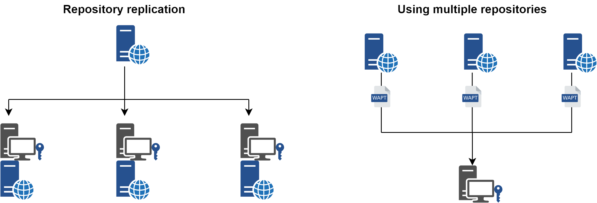

.. Reminder for header structure :
   Niveau 1 : ====================
   Niveau 2 : --------------------
   Niveau 3 : ++++++++++++++++++++
   Niveau 4 : """"""""""""""""""""
   Niveau 5 : ^^^^^^^^^^^^^^^^^^^^

.. meta::
  :description: Replicating repositories and working with multiple repositories
  :keywords: multi-repo, multi-repositories, replicate, replication, bandwidth,
             Edge Computing

.. _wapt_multi-repositories:

Replicating repositories and working with multiple repositories
===============================================================

Large organizations with remote sites and subsidiaries sometimes
require services to be replicated locally to avoid bandwidth congestion
(*Edge Computing*).

    Repository replication and multiple repositories

.. versionadded:: WAPT Enterprise 1.8

**WAPT Enterprise offers the possibility to upgrade remote agents to serve
as remote repositories that can be managed directly from the WAPT Console.
All WAPT agents can then be centrally configured to automatically select the best
repository based on a set of rules**.

You'll find in this part of the documentation how to implement
such architectures.

.. toctree::
  :maxdepth: 1

  wapt-replicate-to-multiple-repositories/index.rst

Speaking of repositories, it is sometimes useful to configure two
or more repositories for different uses (prod, dev, licensed, selfservice).

.. toctree::
  :maxdepth: 1

  wapt-work-with-repositories/index.rst

Deprecated configurations and features
--------------------------------------

.. toctree::
  :maxdepth: 1

  wapt-replicate-to-multiple-repositories/syncthing_usage.rst
