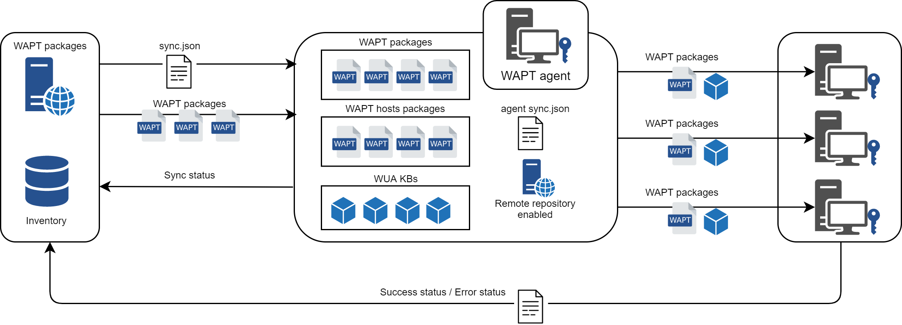
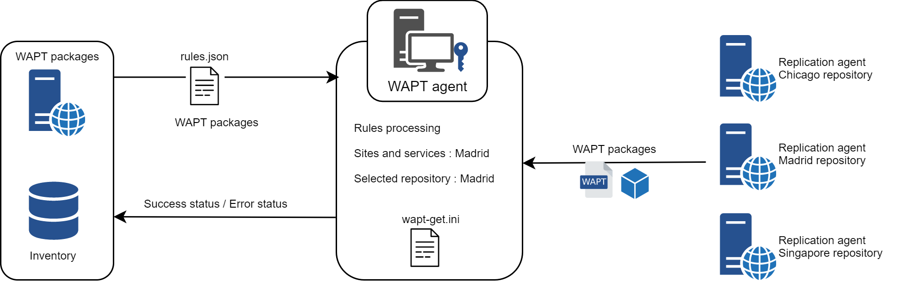

.. Reminder for header structure :
   Niveau 1 : ====================
   Niveau 2 : --------------------
   Niveau 3 : ++++++++++++++++++++
   Niveau 4 : """"""""""""""""""""
   Niveau 5 : ^^^^^^^^^^^^^^^^^^^^

.. meta::
  :description: Replicating a repository to preserve the bandwidth
                on remote sites
  :keywords: multiple repository, WAPT, replication, replicate,
             bandwidth, Syncthing

.. _replication_usage:

Replicating a repository to preserve the bandwidth on remote sites
==================================================================

When WAPT is used on bandwidth limited remote sites, it makes sense to have
a local device that replicates the main WAPT repository to reduce
the network bandwidth consumed when deploying updates on your remote devices.

With remote repositories, WAPT remains a solution with a low operating cost
because you don't have to implement high bandwidth
fiber links to take advantage of WAPT.

    Replicating WAPT repositories

It works as follows:

  * a small form factor and no maintenance appliance with the role
    of secondary repository is deployed on the local network
    of each remote site;

  * the remote repository replicates the packages from the main repository
    and other repositories;

  * the WAPT clients connect in priority with the repository
    that is the closest to them, the local repository;

.. hint::

  The former method used to sync repositories was Syncthing. 
  
  You can find the old documentation here : :ref:`syncthing_usage`

WAPT Agent replication role
---------------------------

Starting with WAPT 1.8, repository replication can be enabled using WAPT agent installed on an existing machine, a dedicated appliance or Virtual Machine.

The replication role is deployed through a WAPT package that enables Nginx web server and configures scheduling, packages types, packages sync, and much more.

Coming with that feature, repository rules allows agent to dynamically select the best WAPT repository from a list of rules stored on the server.

Replication behavior
++++++++++++++++++++

Repository replication in WAPT is now handled by WAPT Agent natively (Enterprise versions only)

It's based on a ``sync.json`` file which indexes every files present in these folders :

* wapt
* waptwua
* wapt-host

Enabling replication has the following effects :

* Once ``enable_remote_repo`` is enabled on an agent, it will sync packages locally inside the ``local_repo_path`` folder.
* It adds that agent in the :guilabel:`Repositories` tab as a Remote repository, enabling new actions such as :guilabel:`Force Sync` or :guilabel:`Check files`.
* By default, only wapt folder is synced, you can select which folder to sync by adding up elements in ``remote_repo_dirs`` parameters.
* Synchronization period can be configured with ``local_repo_time_for_sync_start`` and ``local_repo_time_for_sync_stop`` parameters
* Bandwidth allocated to sync is configured with ``local_repo_limit_bandwidth``

Every parameters of WAPT repository sync must be set in ``[repo-sync]`` section of :file:`wapt-get.ini`

    Replication role behavior

Enabling replication on WAPT Agent 
++++++++++++++++++++++++++++++++++

To enable replication on an existing agent (Linux/Windows) you need to deploy a WAPT package. It's role is to :

* Install and enable Nginx web server
* Configure nginx virtualhost
* Enable remote repository configuration in :file:`wapt-get.ini`

A package is available in our public store to enable repository replication on Windows or Linux WAPT agent : https://store.wapt.fr/store/tis-remote-repo-conf

WAPT Agent replication configuration
""""""""""""""""""""""""""""""""""""

WAPT Agent replication configuration is set in ``[repo-sync]`` section of :file:`wapt-get.ini` :

==================================== ======================= =========================== ====================================================================================
Options                              Mandatory               Example value               Definition
==================================== ======================= =========================== ====================================================================================
``enable_remote_repo``               Yes                     ``True``                    Enables remote repository sync connections.

``local_repo_path``                  Yes                     ``/var/www/``               Set local packages root repository path 

``local_repo_time_for_sync_start``   No                      ``22:30``                   Set sync start time (HH:MM / 24h format)

``local_repo_time_for_sync_end``     No                      ``05:30``                   Set sync stop time (HH:MM / 24h format)

``local_repo_sync_task_period``      No                      ``25``                      Set sync period (minutes)

``local_repo_limit_bandwidth``       No                      ``2``                       Set sync allowed bandwidth (Mbits/s)

``remote_repo_dirs``                 No                      ``wapt,waptwua,wapt-host``  Set synced folders (default: wapt,waptwua)
==================================== ======================= =========================== ====================================================================================

Below an example of :file:`wapt-get.ini` :

.. code::

  [global]
  ...
  use_repo_rules = True

  [repo-sync]
  enable_remote_repo = True
  local_repo_path = D:\WAPT\
  local_repo_time_for_sync_start = 20:30
  local_repo_time_for_sync_end = 05:30
  local_repo_sync_task_period = 25
  local_repo_limit_bandwidth = 4
  remote_repo_dirs = wapt,waptwua,wapt-host

WAPT Server replication configuration
"""""""""""""""""""""""""""""""""""""

WAPT Server need to be aware of repository sync in ``[global]`` section of :file:`waptserver.ini` :

==================================== ======================= ======================================================
Options                              Example value           Definition
==================================== ======================= ======================================================
``remote_repo_support``              True                    Enables remote repository sync server side (sync.json)
==================================== ======================= ======================================================

Repository rules
---------------------------

Repository rules behavior
+++++++++++++++++++++++++

By enabling repository rules support, WAPT agent will automatically retrieve :file:`rules.json` file from WAPT server.

The :file:`rules.json` file is a signed JSON file containing a list of sorted rules to apply to WAPT agent, redirecting its downloads to the appropriate repository.

If no rules can be matched, WAPT agent fallbacks to :file:`wapt-get.ini` :command:`repo_url` file settings.

    Repository rules behavior

Enabling repository rules
+++++++++++++++++++++++++

Repository rules are configured in WAPT Console.

It can be based on several parameters :

==================================== =========================== ====================================================================================
Options                              Example value               Definition
==================================== =========================== ====================================================================================
Domain name                          ``ad.domain.lan``           Rule based on Active Directory domain name 
Domain sites and services            ``Paris-HQ``                Rule based on Active Directory Sites and Services
Agent IP                             ``192.168.85.0/24``         Rule based on Agent IP sub-network
Public IP                            ``256.89.299.22/32``        Rule based on Public IP (NATed hosts)
Hostname                             ``desktop-04feb1``          Rule based on hostname
==================================== =========================== ====================================================================================

Add a rule in WAPT Console
"""""""""""""""""""""""""""

:TODO:

Use repository rules on WAPT agent
""""""""""""""""""""""""""""""""""

.. warning::

  If you already configured GeoIP redirects on Nginx, you should disable it as it might conflicts with repository rules.
  

To enable WAPT Agent repository rules usage, you must enable a settings in ``[global]`` section of :file:`wapt-get.ini` :

==================================== ======================= =========================== ====================================================================================
Options                              Mandatory               Example value               Definition
==================================== ======================= =========================== ====================================================================================
``use_repo_rules``                   No                      ``True``                    Enables repository rules usage
==================================== ======================= =========================== ====================================================================================

Below an example of :file:`wapt-get.ini` :

.. code::

  [global]
  ...
  use_repo_rules = True