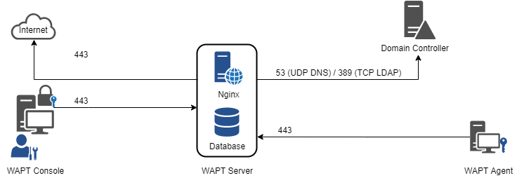

.. Reminder for header structure:
   Niveau 1: ====================
   Niveau 2: --------------------
   Niveau 3: ++++++++++++++++++++
   Niveau 4: """"""""""""""""""""
   Niveau 5: ^^^^^^^^^^^^^^^^^^^^

.. meta::
    :description: Configuring the firewall on the WAPT Server
    :keywords: Firewall, WAPT, security, Kerberos, documentation

.. _firewall_wapt_secure:

Configuring the firewall on the WAPT Server
+++++++++++++++++++++++++++++++++++++++++++

WAPT Server firewall configuration is essential and should be the first step
towards achieving better security in WAPT.

As WAPT aims to be secure by design, only a minimal set of open ports is needed
on the WAPT Server compared to other solutions.

You will find in the following documentation firewall tips
to improve WAPT security.

   Data-flow diagram of WAPT

As you can see, only ports 80 and 443 must be opened for incoming
connections as the WAPT frameworks works with websockets initiated
by the WAPT agents.

Configuring the firewall for WAPT Server on Debian Linux
""""""""""""""""""""""""""""""""""""""""""""""""""""""""

**By default on Debian Linux, no firewall rule applies**.

* disable :program:`ufw` and install :program:`firewalld` instead:

  .. code-block:: bash

      ufw disable
      apt update
      apt -y install firewalld

* simply apply this :program:`firewalld` configuration:

  .. code-block:: bash

      systemctl start firewalld
      systemctl enable firewalld
      firewall-cmd --zone=public --add-port=80/tcp --permanent
      firewall-cmd --zone=public --add-port=443/tcp --permanent
      systemctl restart firewalld

Configuring the firewall for WAPT Server on CentOS
""""""""""""""""""""""""""""""""""""""""""""""""""

* simply apply this :program:`firewalld` configuration:

  .. code-block:: bash

      systemctl start firewalld
      systemctl enable firewalld
      firewall-cmd --zone=public --add-port=80/tcp --permanent
      firewall-cmd --zone=public --add-port=443/tcp --permanent
      systemctl restart firewalld
