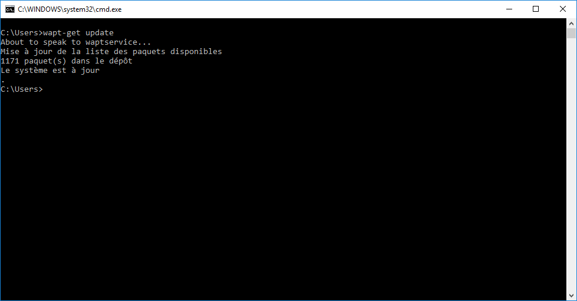

.. Reminder for header structure:
   Niveau 1: ====================
   Niveau 2: --------------------
   Niveau 3: ++++++++++++++++++++
   Niveau 4: """"""""""""""""""""
   Niveau 5: ^^^^^^^^^^^^^^^^^^^^

.. meta::
    :description: Using WAPT with the Command Line
    :keywords: command line, WAPT, CLI, documentation

.. _wapt_cli:

Using WAPT with the Command Line
================================

The WAPT agent provides a command line interface utility :program:`wapt-get`.

  The Windows Command Line utility

.. note::

  * by default, command-line actions in WAPT are executed with the rights
    of the user who launched the :program:`cmd.exe`;

  * if the :term:`User` is not a :term:`Local Administrator` or if
    the :program:`cmd.exe` has not been launched with :term:`Local Administrator`
    privileges, the command will be passed on to the :program:`waptservice`;

  * for security reasons, some actions will require a login and a password;

  * only :term:`Local Administrators` and members of the *waptselfservice*
    Active Directory security group are allowed;

  * to force using the WAPT service as a :term:`Local Administrator`,
    simply add *-S* after :command:`wapt-get.exe`;

.. toctree::
  :maxdepth: 3

  command-line-interface-common-usage.rst
  command-line-interface-special-usage.rst
  command-line-interface-create-packages.rst
