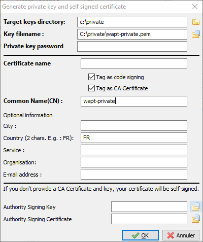
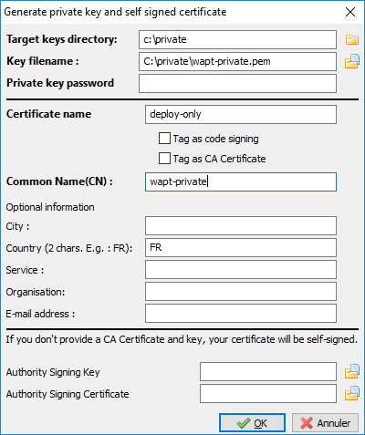
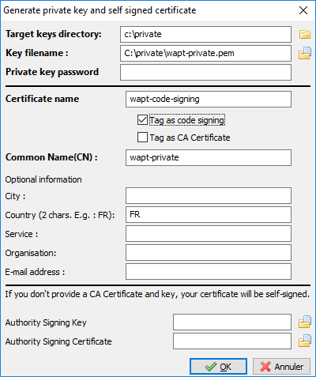

.. Reminder for header structure :
   Niveau 1 : ====================
   Niveau 2 : --------------------
   Niveau 3 : ++++++++++++++++++++
   Niveau 4 : """"""""""""""""""""
   Niveau 5 : ^^^^^^^^^^^^^^^^^^^^

.. meta::
  :description: Differentiating Administrators in WAPT
  :keywords: role level, WAPT, Certificate Authority, Code Signing,
             Administrator, Package Developer, Package Deployer, CA,
             documentation

.. versionadded:: 1.5 Enterprise

.. _new_crt_with_ca:

Differentiating the role level in WAPT
--------------------------------------

.. hint::

  Feature only available with WAPT Enterprise
  

Generating a new certificate
++++++++++++++++++++++++++++

  Generating a new self-signed certificate

Generating the Certificate Authority (CA)
+++++++++++++++++++++++++++++++++++++++++

When installing WAPT, you are asked to create a pem / crt pair by checking
the boxes :guilabel:`Certificate CA` and :guilabel:`Code Signing`.

This crt/ pem pair will allow to sign WAPT packages and new certificates.

Generating a new certificate with the Certificate Authority
+++++++++++++++++++++++++++++++++++++++++++++++++++++++++++

To create a new pem/ crt pair from the private key, click on
:guilabel:`Create a certificate`.

.. note::

  The new certificate will not be a self-signed certificate;

  This new certificate will be signed by the AC (the key generated at the time of the first installation of WAPT);

You must then fill in the :guilabel:`AC's certificate`
and the :guilabel:`AC's key`.

When generating the new pem/ crt pair, you have the option to choose whether
or not the new certificate will a **Code Signing** type.

.. hint::

  For recall, a *Code Signing* certificate is reserved to individuals
  with the :term:`Administrator` role in the context of WAPT and a simple SSL
  certificate without the ``Code Signing`` attribute is reserved to individuals
  with the role of :term:`Package Deployer`.

  :term:`Administrators` will be authorized to sign packages
  that **CONTAIN** a :file:`setup.py` executable file (i.e. *base* packages).

  Individuals with the :term:`Package Deployer` role will be authorized
  to sign packages that **DO NOT CONTAIN** :file:`setup.py` executable file
  (i.e. *host*, *unit* and *group* packages).

  Generating a certificate without the *Code Signing* attribute

Keys and certificates that are **Not Code Signing** may be distributed
to individuals in charge of deploying packages on the installed base of
WAPT equipped devices.

Another team with certificates having the **Code Signing** attribute
will prepare the WAPT packages that contain applications that will need
to be configured according to the :term:`Organization`'s security guidelines
and the user customizations desired by her.

  Generating a certificate with the *Code Signing* attribute

Generating a new prm/ crt pair will also allow to formally identify
the individual who has signed a package by looking up the WAPT package
certificate's :abbr:`CN (Common Name)` attribute.

.. hint::

  The new certificates will not be *CA Certificates*, which means that they will
  not be authorized to sign other certificates.

  As a general rule, there is only one **CA Certificate** pem / crt pair per
  :term:`Organization`.
