.. Reminder for header structure:
   Niveau 1: ====================
   Niveau 2: --------------------
   Niveau 3: ++++++++++++++++++++
   Niveau 4: """"""""""""""""""""
   Niveau 5: ^^^^^^^^^^^^^^^^^^^^

.. meta::
   :description: Using the WAPT console
   :keywords: WAPT, console, documentation

.. _using_the_WAPT_console:

Using the WAPT console
======================

Installing the WAPT agent on the devices in your Organization
-------------------------------------------------------------

If you have not done so already, install the WAPT agent on a computer.

The installation of the WAPT agent on computers will register them on
the WAPT inventory server.

The hosts will then appear in the WAPT console.

To install the WAPT agent manually on a computer, download the WAPT agent
from https://wapt_server/wapt/waptagent.exe then launch its installation.

.. figure:: wapt_console-configuration-summary.png
   :align: center
   :alt: Download the WAPT agent to be deployed on computers

   Download the WAPT agent to be deployed on computers

.. note::

  If you have skipped the step for creating the WAPT agent, return to
  the documentation on :ref:`installing the WAPT agent <install_waptagent>`.

On your **management computer**, hosts are displayed in the WAPT console.

.. figure:: wapt_console-registered-clients.png
   :align: center
   :alt: Inventory of hosts registered with WAPT

   Inventory of hosts registered with WAPT

.. note::

  If a host does not appear in the console after having installed the WAPT
  agent, open the Windows command line utility :program:`cmd.exe`
  on the host and type :command:`wapt-get register`.

Duplicating packages from external repositories
-----------------------------------------------

.. raw:: html

  
<iframe width="560" height="315" src="https://www.youtube.com/embed/GqdfcXqr83c?rel=0&amp;showinfo=0" frameborder="0" allowfullscreen></iframe>

Package duplication principles
++++++++++++++++++++++++++++++

Duplicating a WAPT package consists of:

* importing an existing WAPT package from an external repository;

* changing its prefix (for example from *tis* to *test*);

* resigning the WAPT package with the :term:`Administrator`'s private key
  to allow the deployment of the duplicated package on your WAPT equipped hosts;

* finally, uploading it on the main WAPT repository;

.. attention::

    By importing a package in your repository and signing it, you then become
    responsible for that package and for what it does.
    **It has been signed with your own private key**.

    **Tranquil IT** disclaims any liability if you choose to use WAPT packages
    retrieved from her repositories. Without a support contract, Tranquil IT
    does not guarantee the suitability of the package for your own particular
    use case, nor do they guarantee the ability of the package to comply
    with your :term:`Organization`'s internal security policies.

* go to the :guilabel:`Private repository` tab;

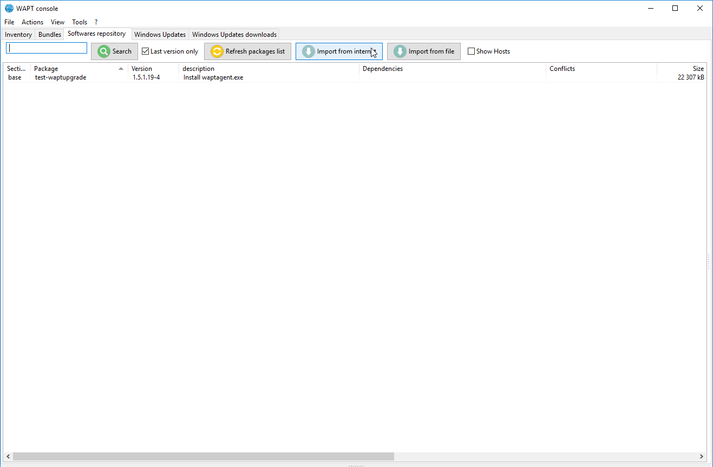

   Available software displayed in the WAPT console

Every software package version available on the WAPT repository is shown.

If no package has been imported, the list is empty. Only the *test-waptupgrade*
package will be present if the WAPT agent has been generated previously.
Visit the documentation on :ref:`creating a WAPT agent <create_WAPT_agent>`.

Two options are available to import packages:

Import a package from an external repository on the Internet
""""""""""""""""""""""""""""""""""""""""""""""""""""""""""""

That first method allows you to download packages directly from a WAPT repository
external to your :term:`Organization`.

To import from a different repository than Tranquil IT, define a new repository
address in the WAPT console preferences.
For example: http://wapt.otherorganization.com/wapt/.

.. note::

  * If no repository is set, the repository https://wapt.tranquil.it/wapt will
    be implicitly set.

  * Starting with WAPT 1.3.12.13, **external repository SSL/ TLS certificates
    are verified by default**.

* click on :guilabel:`Import from Internet`;

   Import a package from Internet

The grid view displays the list of available packages on the remote repository.

* to import a package, select a package then :menuselection:`Right-click
  --> Import`;

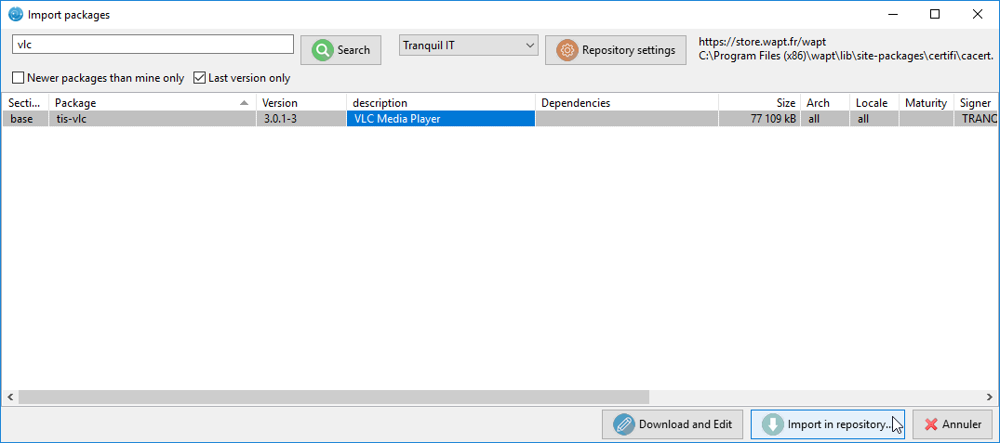

   Imported WAPT package in your local WAPT repository

* validate the duplication in your local repository;

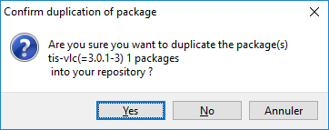

   Confirm the duplication of the package

* click on :guilabel:`Yes` to confirm the duplication;

* the download of the package starts ...

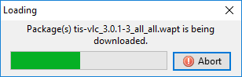

   Progress of the package duplication process

* then, enter your private key password...

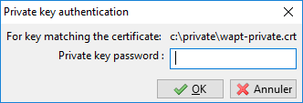

   Enter the password for unlocking the private key

The WAPT console confirms that the package has been duplicated
in your local WAPT repository.

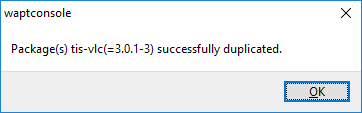

   Confirmation of successful duplication

The package then appears in your local WAPT repository with your Organization's
prefix.

.. figure:: wapt_console-confirm-package-duplicate.png
  :align: center
  :alt: WAPT console displaying the duplicated package

  WAPT console displaying the duplicated package

.. attention::

  If the verification of the package signature is enabled, the public
  certificate of the signer must be located in one of the following folders:

  * :file:`C:\\Program Files (x86)\\wapt\\ssl`;

  * :file:`%appdata%\\waptconsole\\ssl`;

  If the certificate is not found in one of these two folders, then the
  following error will occur and the package will not be imported.

  .. figure:: wapt_console-error-with-package-signature.png
    :align: center
    :alt: Error while validating the signature of the external repository

    Error while validating the signature of the external repository

Editing a package before importing it
"""""""""""""""""""""""""""""""""""""

Starting with WAPT 1.3.12.13, it is now possible to edit a package downloaded
from an external repository before importing it in your main WAPT repository.

To achieve this, choose instead the second option :guilabel:`Download and Edit`
to import the package from an external WAPT repository.

.. figure:: wapt_console-import-edit-package.png
   :align: center
   :alt: Process for importing and editing a package

   Process for importing and editing a package

:program:`PyScripter`, if installed, opens the WAPT package.

Please refer to the documentation on :ref:`creating WAPT packages
from scratch <creating_WAPT_packages>`.

Importing a WAPT package from a file
""""""""""""""""""""""""""""""""""""

That second method allows you to import a :file:`.wapt` file from any medium.

* click on :guilabel:`Import from File`;

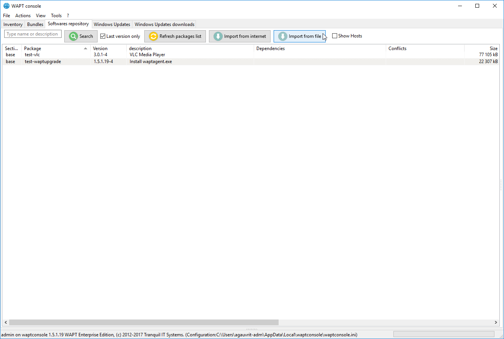

   Import from a file

* select the file to import;

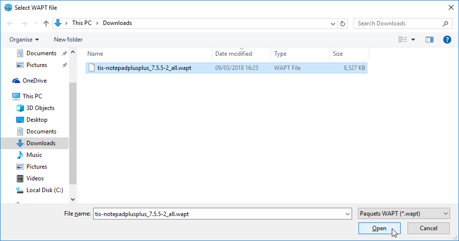

   Select the file to import

* click on :guilabel:`Open` to import the file;

The WAPT console confirms that the package has been duplicated in your local
WAPT repository.

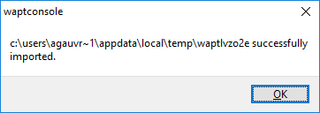

   File imported successfully

The package then appears in your local WAPT repository with your
Organization's prefix.

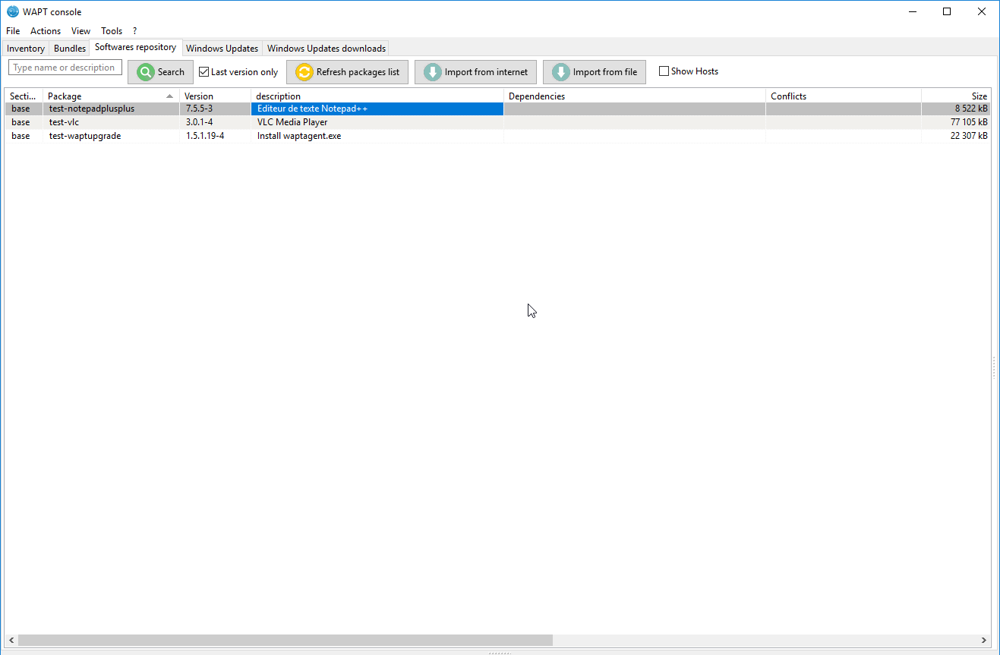

   Imported WAPT package in your local WAPT repository

Changing the prefix and re-signing a WAPT package
+++++++++++++++++++++++++++++++++++++++++++++++++

When importing, the changing of the prefix and the re-signing of the WAPT
package are transparent and automatic.

Once the package is ready, the WAPT package is uploaded
onto the main WAPT repository.

Deploying WAPT packages from the WAPT console
---------------------------------------------

* edit the host onto which you want to deploy a WAPT package;

.. note::

  Selecting multiple hosts using common shortcut keys :kbd:`Control-A`
  or :kbd:`Shift-Arrow` is possible.

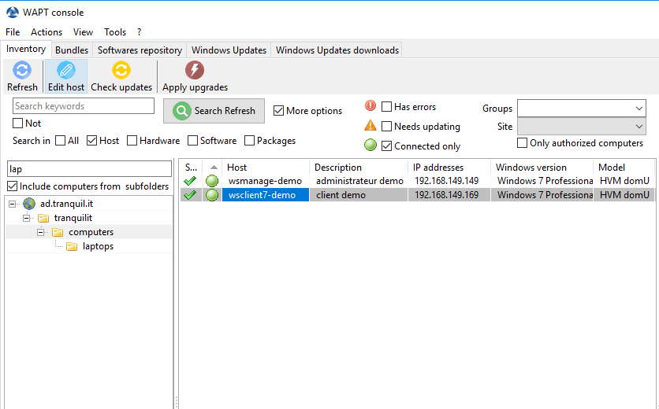

   Select the host to configure

* A window opens, on the right side appears the list of packages available
  on the local WAPT repository, and on the left side it shows the list
  of packages currently assigned to the host.

* drag and drop packages from the right pane to the left pane;

.. figure:: wapt_console-drag-and-drop-package-to-host.png
   :align: center
   :alt: Drag and drop the package on the host or the selection of hosts

   Drag and drop the package on the host or the selection of hosts

* clicking on :guilabel:`Save and Apply to hosts` will launch the installation
  of the package(s) immediately on the selected host(s) that are connected
  to the WAPT Server;

* clicking on :guilabel:`Save` will save the current configuration.
  Upgrading of the packages will occur during the WAPT agents' next update
  cycle;

.. figure:: wapt_console-save-and-apply-button.png
   :align: center
   :alt: Save and apply configuration on selected host(s)

   Save and apply configuration on selected host(s)

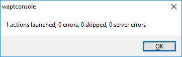

   Update launched

To launch the installation of WAPT packages, click successively
on :guilabel:`Update available packages` then :guilabel:`Apply updates`.

.. figure:: wapt_console-apply-upgrade-from-menu.png
   :align: center
   :alt: Applying updates

   Applying updates

The installation of the WAPT package(s) is launched on the selected host(s)
connected to the WAPT Server.
