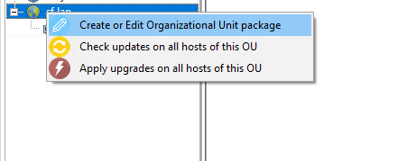
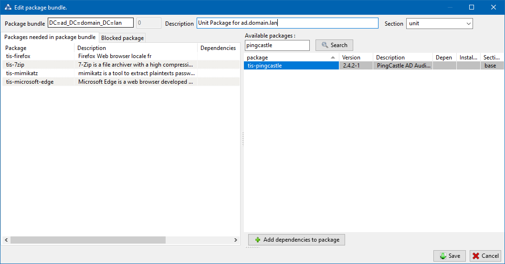

.. Reminder for header structure:
   Niveau 1: ====================
   Niveau 2: --------------------
   Niveau 3: ++++++++++++++++++++
   Niveau 4: """"""""""""""""""""
   Niveau 5: ^^^^^^^^^^^^^^^^^^^^

.. meta::
  :description: Using Organizational Unit packages in WAPT
  :keywords: WAPT, console, organizational, unit, OU, UO, Active Directory

.. _wapt_organizational_unit:

.. versionadded:: 1.7 Enterprise

Using Organizational Unit packages in WAPT
===========================================

.. hint::

  Feature only available with WAPT **Enterprise**.

Working principle
-----------------

WAPT Enterprise offers organizational unit packages functionnality.

It automates software installations based on your Active Directory infrastructure.

The WAPT agent is aware of its position in the Active Directorytree structure,
therefore it knows the hierarchy of Organizational Units that concerns it,
for example:

.. code-block:: bash

  DC=ad,DC=domain,DC=lan
  OU=Paris,DC=ad,DC=domain,DC=lan
  OU=computers,OU=Paris,DC=ad,DC=domain,DC=lan
  OU=service1,OU=computers,OU=Paris,DC=ad,DC=domain,DC=lan

If an Organizational Unit package is defined on each level, WAPT agent
will automtically download packages and configurations that are attached
to each level, by inheritance, and apply attached packages
and their dependencies.

Filters and actions available with Organizational Units
-------------------------------------------------------

.. figure:: wapt_console-access-to-organisational-unit-menu.png
  :align: center
  :alt: WAPT console showing options applicable to OU

  WAPT console showing options applicable to OU

.. hint::

  You can see in the picture that **update** and **upgrade** actions
  can be performed through this menu, thus selecting hosts
  by their Organizational Unit.

In the **Enterprise** version, you may filter how hosts are displayed based
on the Active Directory :abbr:`OU (Organizational Units)` they belong to.

The checkbox :guilabel:`Include hosts in subfolders` allows to display hosts
in subfolders.

Creating Organizational Unit packages in the WAPT console
---------------------------------------------------------

You can create *unit* packages by :menuselection:`Right clicking
on an OU --> Create or edit the unit package`.

  Right-click on OU to create unit package.

A window opens and you are prompted to choose which packages
must be in **unit** bundle.

  Adding package to unit bundle.

Save the package and it will be uploaded to the WAPT server.

Faking organizational unit for WORKGROUP hosts
----------------------------------------------

It can happen that some specific hosts cannot be joined to an Active Directory
domain.

With that specificity, such hosts do not show up in your Active Directory
Organizational Units in your WAPT Console.

To make all hosts show up in the console under the right Organizational Unit,
whether they are joined to an AD domain or not, WAPT allows you to specify
a *fake* Organizational Unit WAPT agent configuration file.

The benefits of this trick are:

* you can manage these hosts with WAPT as if they where joined to the AD;

* out-of-domain and workgroup hosts are now showing up in AD tree view;

* *unit* packages are usable on these hosts;

To setup a *fake* Organisational Unit on hosts, create an empty WAPT package;

.. code-block:: bash

  wapt-get make-template demo-configure-fake-ou

Then use the following code:

.. code-block:: python

  # -*- coding: utf-8 -*-
  from setuphelpers import *

  uninstallkey = []

  def install():

    print('Setting Fake Organizational Unit')
    fake_ou = "OU=TOTO,OU=TEST,DC=DEMO,DC=LAN"
    inifile_writestring(WAPT.config_filename,'global','host_organizational_unit_dn',fake_ou)

The ``host_organizational_unit_dn`` must be like below in :file:`wapt-get.ini`:

.. code-block:: ini

  [global]
  host_organizational_unit_dn="OU=TOTO,OU=TEST,DC=DEMO,DC=LAN"
