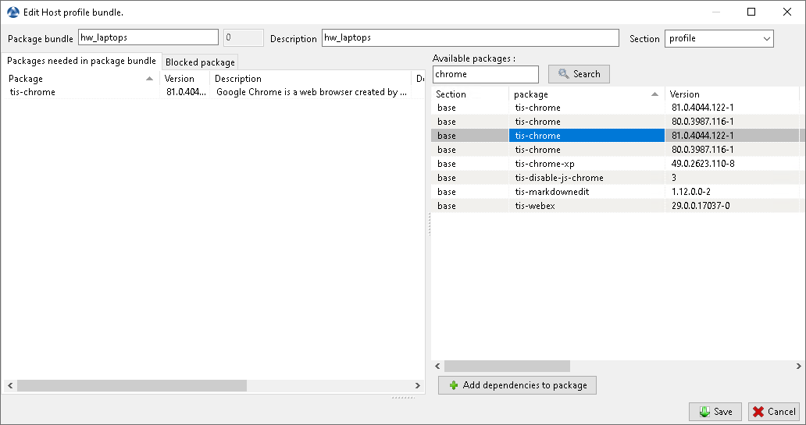

.. Reminder for header structure:
   Niveau 1: ====================
   Niveau 2: --------------------
   Niveau 3: ++++++++++++++++++++
   Niveau 4: """"""""""""""""""""
   Niveau 5: ^^^^^^^^^^^^^^^^^^^^

.. meta::
  :description: Using profile bundles in WAPT
  :keywords: WAPT, console, profile, Active Directory

.. _wapt_profile_bundles:

.. versionadded:: 1.7 Enterprise

Using profile bundles in WAPT
=============================

.. hint::

  Feature only available with WAPT **Enterprise**.

Working principle
-----------------

WAPT Enterprise offers Active Directory profile bundle functionnality.

It automates installation of WAPT software and configuration packages
on hosts, based on their membership to Active Directory Computer Security Groups.

.. important::

  **Active Directory Computer's security groups contains Computers, not Users**.

  .. figure:: profile-bundle/wapt-profile-bundle-computer-groups.png
    :align: center
    :alt: Active Directory computer group

    Active Directory computer group

    Automatically installing software and configurations based on user
    and user group membership is not implemented with WAPT. This use case
    is better served with the differenciated :ref:`self-service <wapt-selfservice>`
    feature that is also available with WAPT Enterprise.

Creating profile bundle packages in WAPT console
------------------------------------------------

You can create *profile* bundle packages by clicking on
:menuselection:`Bundles -> Create AD Profile`.

  Right-click on OU to create unit bundle

.. important::

  Requirements:

  * the *profile* package name must be **exactly**  the same as the AD Security
    group name;

  * the *profile* package name is case sensitive;

  Example:

  * AD Security group: ``HW_laptops``;

  * WAPT profile bundle: ``HW_laptops``;

A window opens and you are prompted to choose which packages
must be in the just created **profile** bundle.

  Adding package to profile bundle

Save the *profile* bundle package and it will be uploaded to the WAPT server.
