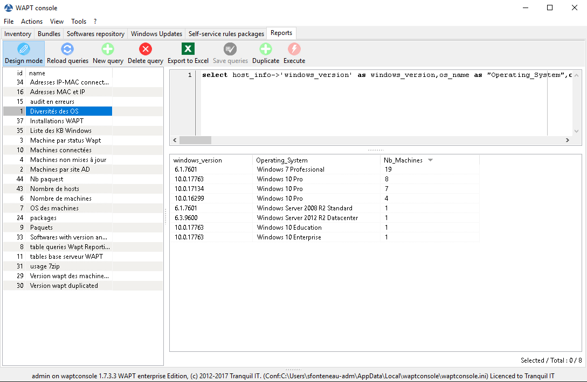
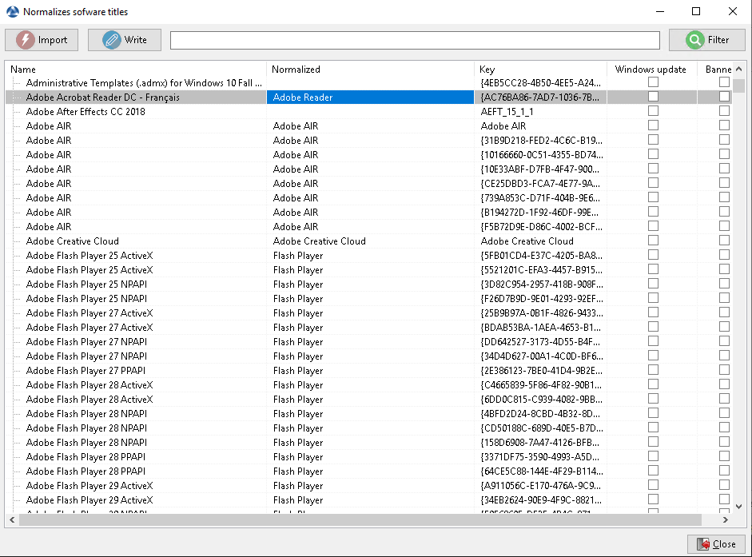

.. Reminder for header structure :
   Niveau 1 : ====================
   Niveau 2 : --------------------
   Niveau 3 : ++++++++++++++++++++
   Niveau 4 : """"""""""""""""""""
   Niveau 5 : ^^^^^^^^^^^^^^^^^^^^

.. meta::
  :description: Using the WAPT console
  :keywords: WAPT, console, documentation

.. _wapt_reporting:

.. versionadded:: 1.7

Using Reporting
====================================

.. hint::

  Feature only available with WAPT Enterprise

Principle
-----------

WAPT Enterprise proposes reporting possibilities. 

Indeed, who better than you know what you want in your report.

With WAPT we offer to write your own SQL query to display the result in the wapt console.
	
	
Query Designer
--------------------------------------------

The query designer offers you the ability to write down your own queries on WAPT database.

To create a new query, click the :guilabel:`Reporting` tab, click :guilabel:`Design Mode` and :guilabel:`New query`

.. hint::

 * To rename a request, use the F2 key
 * In the top banner, you can write your SQL query.

To edit/modify/save your queries :
	
* The :guilabel:`Reload queries` button is used to reload requests saved on the server. (For example, if a colleague has just saved a query.)
* The :guilabel:`New query` button adds a new empty query to the list 
* Using :guilabel:`Delete query` button will delete the selected query from the WAPT server.
* You can export the result of your requests to Excel with the :guilabel:`Export to Excel` button
* When you have finished writing your query, click on :guilabel:`Save queries`.
* The :guilabel:`Duplicate` button allows you to copy an existing query to avoid writing a request from scratch.
* You can test your requests with the :guilabel:`Execute` button

.. note::

 * The queries are saved in the PostgreSQL WAPT database.
 * The shortcut CTRL+space offers you some choices directly.

Query examples
+++++++++++++++

* Computers list:

.. code-block:: sql

  select computer_name,os_name,os_version,os_architecture,serialnr from hosts order by 4,3,1

* Computers MAC addresses and IP:

.. code-block:: sql

  select distinct unnest(mac_addresses) as mac,
  unnest(h.connected_ips) as ipaddress,
  computer_fqdn,h.description,h.manufacturer||' '||h. productname as model,h.serialnr,h.computer_type from
  hosts h order by 1,2,3

* Windows versions:

.. code-block:: sql

  select host_info->'windows_version' as windows_version,
  os_name as "Operating_System",
  count(os_name) as "Nb_Machines" from 
  hosts group by 1,2

Normalize the name of the software
------------------------------------------------

One of the main problem with software research is that a software may have several different names and different uninstall keys depending on the version.

To solve this problem, we propose to standardize the name of the software with WAPT.

* Click :guilabel:`Normalize Software Names` in the :guilabel:`Tools` menu.
* Select the software to standardize. (for example, all different version of Adobe Flash Player)
* On the column :guilabel:`normalized`, press :guilabel:`F2` to assign a standardized name to the selected software. Then press Enter

.. note:: 
  
 * To select several programs, select them with the shift-flech key combination
 * You can also indicate a software like "windows update" or "banned" ("Press spacebar" in the corresponding column)

* Press on :guilabel:`Import` to load the changes from the server
* Press on :guilabel:`Write` to save the changes

You can now search on this standardized name.