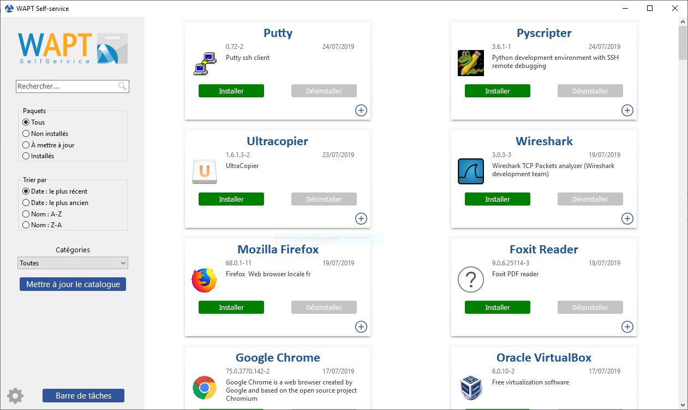

.. Reminder for header structure:
   Niveau 1: ====================
   Niveau 2: --------------------
   Niveau 3: ++++++++++++++++++++
   Niveau 4: """"""""""""""""""""
   Niveau 5: ^^^^^^^^^^^^^^^^^^^^

.. meta::
  :description: Using WAPT SelfService
  :keywords: WAPT, selfservice, documentation

.. |pinguin| image:: ../icons/emoji/pinguin.png
 :scale: 20%
 :alt: Pinguin emoji

.. |enterprise_feature| image:: ../icons/wapt_enterprise_feature_only.png
 :scale: 100%
 :alt: WAPT Enterprise feature only

.. _wapt-selfservice:

Using WAPT SelfService
======================

|enterprise_feature|

.. versionadded:: 1.7 Enterprise

Presentation
------------

With WAPT 1.7 **Enterprise** you can now filter the list
of self-service packages available for your users.

Your users will be able to install a selection of WAPT packages
without having to be a :term:`Local Administrator` on their desktop.

The :term:`Users` gain in autonomy while deploying software and configurations
that are trusted and authorized by the :term:`Organization`.
This is a time saving feature for the Organization's IT support Helpdesk.

How does it work?
-----------------

With WAPT 1.7 **Enterprise**, a new type of WAPT package exists beside *base*,
*group*, *host*, *profile* and *unit* packages:
they are **selfservice** packages.

.. figure:: wapt_console-selfservice.png
  :align: center
  :alt: Create a *selfservice* package

  Create a *selfservice* package

A *selfservice* package may now be deployed on hosts to list the different
self-service rules that apply to the host.

How to use the **selfservice** feature?
---------------------------------------

.. hint::

  The **selfservice** feature is only available with WAPT **Enterprise**.

  In the **Community** version, only Local Administrators and members
  of the *waptselfservice* group can access self-service on the agent.

  In the **Community** version, it is not possible to filter
  the packages made accessible to the user.

In the console go to the tab :guilabel:`Self-service` rules.

You can now create your first *selfservice* rule package.

* give a name to your new *selfservice* package;

* click on :guilabel:`Add` to add an Active Directory group (at the bottom left);

* name the *selfservice* group (with :kbd:`F2` or type directly into the cell);

* drag the allowed software and configuration packages
  for this *selfservice* group into the central column;

* add as many groups as you want in the package;

* save the package and deploy the package on your selection of hosts;

* once the package is deployed, only allowed packages listed
  in the *selfservice* group(s) of which the :term:`User` is a member
  will be shown to the logged in :term:`User`;

.. note::

  * if a group appears in multiple *selfservice* packages,
    then the rules are merged;

  * the authentication used is system authentication, local users and groups,
    but if the machine is in a domain then authentication and groups
    will also work with users and groups in the domain;

How to use the self-service on the user station?
------------------------------------------------

The self-service is accessible to users in the start menu under the name
:guilabel:`Self-Service software WAPT`.

It is also available directly in :file:`<base>\\waptself.exe`.

The login and password to enter when launching the self-service
are the User's credentials (local or Active Directory credentials).

The self-service then displays a list of packages available for installation.

* the user can have more details on each package with the :guilabel:`+` icon;

* different filters are available for the user on the left side panel;

* the :guilabel:`Update Catalog` button is used to force a
  :command:`wapt-get update` on the WAPT agent;

* the list of package categories is displayed to the user.
  To add a category to the list, you must specify the category
  in the *categories* section of the :file:`control` file
  of the relevant package;

* the current task list of the WAPT agent is available
  with the :guilabel:`task bar` button;

* it is possible to change the language of the interface
  with the :guilabel:`configuration` button at the bottom left.

Customizing the Self Service interface
++++++++++++++++++++++++++++++++++++++

Adding the Logo of your Organisation
""""""""""""""""""""""""""""""""""""

In the **Enterprise version only of WAPT**, it is possible to change the logo
that appears in the self-service interface and therefore improve the acceptation
of the Self Service feature by your users.

To do this, simply place the logo you want in
:file:`<wapt>\\templates\\waptself-logo.png`

.. note::

   It is highly recommended to use a :mimetype:`.png` file with a *200 x 150px*
   resolution.

Managing package categories
"""""""""""""""""""""""""""

Default categories are:

* Internet;
* Utilities;
* Messaging;
* Security;
* System and network;
* Storage;
* Media;
* Development;
* Office​​;

You can create your own categories easily by filling the :file:`control`
file's ``categories`` section of any WAPT package and write a new category
of your choice, WAPT will automatically show the package in the new category.

WAPT Agent Settings for WAPT Self-Service
-----------------------------------------

WAPT Agent can be configured to force WAPT SelfService packages
filtering to Local Administrators :ref:`waptself_ini_file`.

Configuring a different authentication method for the selfservice
-----------------------------------------------------------------

As mentioned above, authentication on WAPT service is configured
by default in system mode.

This means that the WAPT service transmits the authentication directly
to the operating system; it also recovers the groups by directly interrogating
the operating system.

This behavior is defined with the value of ``service_auth_type``
in :file:`wapt-get.ini`. The default value is *system*.

In this mode we assume that Local Administrators can see all the packages.
To change this behavior, modify the value of ``waptservice_admin_filter``
in :file:`wapt-get.ini`.

You may be interested in looking up this article describing the :ref:`settings
for WAPT Self-Service and Waptservice Authentification <waptself_ini_file>`
for more options.

Two additional modes are available starting with version 1.8.2:

* ``waptserver-ldap``: this mode allows authentication to the WAPT server.
  The WAPT server will make a LDAP request to verify authentication and groups.
  **Warning** ! For this to work, you must have configured LDAP authentication
  on the WAPT server, (the configuration of the admin group will be ignored)
  See :ref:`this article on configuring authentication
  against Active Directory <configure_ad_auth>` for more information.

* ``waptagent-ldap``, This mode allows authentication with an LDAP server
  identified in :file:`wapt-get.ini`. The WAPT agent will make a LDAP request
  to verify authentication and groups.

  You may be interested in looking up this article describing the :ref:`settings
  for WAPT Self-Service and Waptservice Authentification <waptself_ini_file>`
  for more options.

.. note::

  For the system authentication under |pinguin| to work correctly,
  be sure to correctly configure your pam authentication
  and your :file:`nsswitch.conf`. The :command:`id username` command
  must return the list of the groups the user is member of.

Video demonstration
-------------------

.. raw:: html

   <iframe width="560" height="315" src="https://www.youtube.com/embed/-_sm8KBwDOw" frameborder="0" allow="accelerometer; autoplay; encrypted-media; gyroscope; picture-in-picture" allowfullscreen></iframe>
