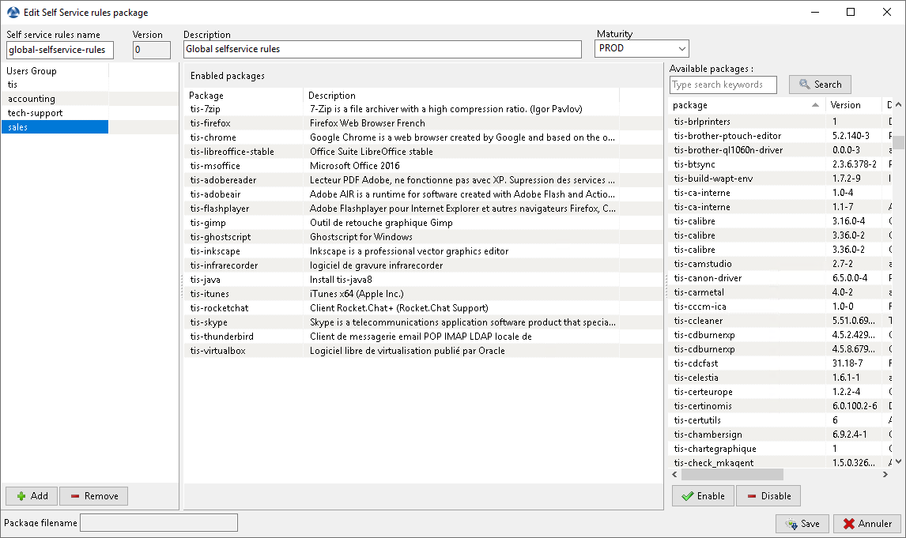

.. Reminder for header structure :
   Niveau 1 : ====================
   Niveau 2 : --------------------
   Niveau 3 : ++++++++++++++++++++
   Niveau 4 : """"""""""""""""""""
   Niveau 5 : ^^^^^^^^^^^^^^^^^^^^

.. meta::
   :description: Using WAPT SelfService
   :keywords: WAPT, selfservice, documentation

.. _wapt-selfservice:

Using WAPT SelfService
======================

.. versionadded:: 1.7 Enterprise

.. hint::

  Feature only available with WAPT Enterprise

Presentation
------------

With WAPT 1.7 you can now filter the list of self-service packages available
for your users.

Your users will be able to install a selection of WAPT packages
without having to be a :term:`Local Administrator` on their desktop.

The :term:`Users` gain in autonomy while deploying software and configurations
that are trusted and authorized by the :term:`Organization`.
This is a time saving feature for the Organization's IT support Helpdesk.

How it works?
-------------

With WAPT 1.7, a new type of WAPT package exists beside *base*, *group*,
*host* and *unit* packages: they are **selfservice** packages.

  Create a *selfservice* package

A *selfservice* package may now be deployed on hosts to list the different
self-service rules that apply to the host.

How to use the **selfservice** feature?
---------------------------------------

In the console go to the tab :guilabel:`Self-service` rules.

You can now create your first *selfservice* rule package.

* give a name to your new *selfservice* package;

* click on :guilabel:`Add` to add an Active Directory group (at the bottom left);

* name the *selfservice* group (with :kbd:`F2` or type directly into the cell);

* drag the allowed software and configuration packages
  for this *selfservice* group into the central column;

* add as many groups as you want in the package;

* save the package and deploy the package on your selection of hosts;

* once the package is deployed, only allowed packages listed
  in the *selfservice* group(s) of which the :term:`User` is a member
  will be shown to the logged in :term:`User`;

.. note::

	If a group appears in multiple *selfservice* packages,
  then the rules will be merged.
