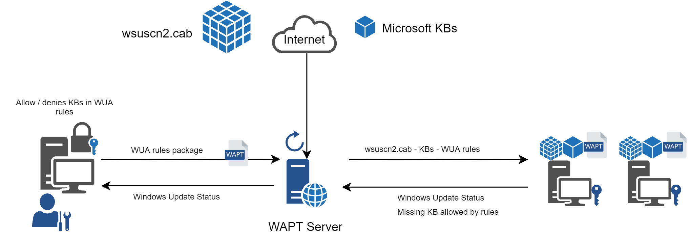
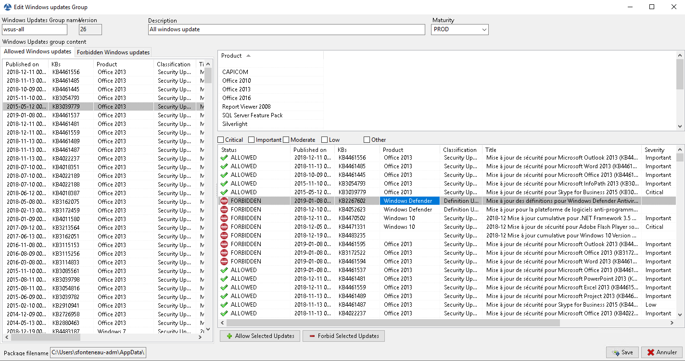
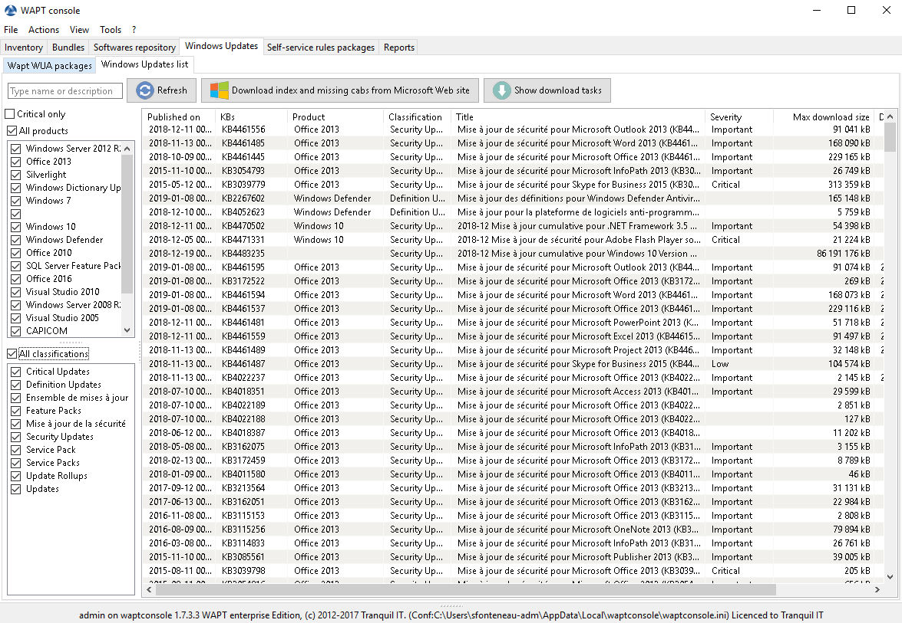

.. Reminder for header structure :
   Niveau 1 : ====================
   Niveau 2 : --------------------
   Niveau 3 : ++++++++++++++++++++
   Niveau 4 : """"""""""""""""""""
   Niveau 5 : ^^^^^^^^^^^^^^^^^^^^

.. meta::
  :description: Using WAPT Windows Update Agent (WAPTWUA)
  :keywords: WAPT, Windows, Updates, WUA, documentation

.. _wapt_wua:

.. versionadded:: 1.7 Enterprise

Using WAPT Windows Update Agent (WAPTWUA)
=========================================

.. hint::

  Feature only available with WAPT **Enterprise** version

.. note::

  Since version 1.7, WAPT is able to manage Windows Updates on your endpoints.

  * The internals of WAPTWUA is based
    on the :abbr:`WUA (Windows Update Agent)` API;

  * For more information: https://docs.microsoft.com/en-us/windows/desktop/wua_sdk/using-the-windows-update-agent-api

Working principle
-----------------

Regularly, the WAPT server downloads an updated :file:`wsuscn2.cab` file
from Microsoft servers. By default, downloads happen once a day
and no download is triggered if the file has not changed
since the last download.

  WAPT Windows Update flow process

The :file:`wsuscn2.cab` file is then downloaded by the WAPT agent
from its nearest repository and then passed on to
the standard :abbr:`WUA (Windows Update Agent)` Windows utility
to crunch the update tree for the host.

Regularly, the machine will analyze the available updates using
the :file:`wsuscn2.cab` file. The list of needed updates as determined by WUA
is then sent from the host to the WAPT server.

If an update is pending on the machine and if that update is not present
on the WAPT server, the server will download the needed update
from Microsoft servers.

.. hint::

  This mode of operation allows to download only the necessary updates
  on the computers, thus saving bandwidth, download time and disk space.

.. note:: Downloaded updates are stored:

  * on Linux servers in :file:`/var/www/waptwua`;
  
  * on Windows servers in :file:`C:\\wapt\\waptserver\\repository\\waptwua`;

The WAPT Windows Update Agent repository download URL is based
on the ``repo_url`` parameter in :file:`wapt-get.ini`:

* in case of repository replication, it is fully operational
  with WAPT Windows Update to reduce bandwidth use;

* do not forget to synchronize the :file:`waptwua` folder
  if you are replicating your packages with distant repositories;

Configuring WAPTWUA on the WAPT agent
-------------------------------------

*WAPTWUA* is configured in :file:`wapt-get.ini`.

Add ``[waptwua]`` section.

You then have several options:

.. tabularcolumns:: |\X{5}{12}|\X{7}{12}|

========================== ==================================== =========================================================================================================================
Options                    Default Value                        Description
========================== ==================================== =========================================================================================================================
``enabled``                False                                Enable or disable WAPTWUA on this machine.
``offline``                True                                 Defined if the scan should be done using :file:`wsuscn2.cab` files or Online with Microsoft servers
``allow_direct_download``  False                                Allow direct download of updates from Microsoft servers if the WAPT server is not available
``default_allow``          False                                Set if missing update is authorized or not by default
``filter``                 Type='Software' or Type='Driver'     Define the filter to apply for the Windows update scan
``download_scheduling``    None                                 Set the Windows Update scan recurrence (Will not do anything if *wsus* package rule or :file:`wsuscn2.cab` file have not changed) (ex: 2h)
``install_scheduling``     None                                 Set the Windows Update install recurrence (Will do nothing if no update is pending) (ex: 2h)
``install_delay``          None                                 Set a deferred installation delay before publication in the repository (ex: 7d)
========================== ==================================== =========================================================================================================================

.. hint::

	These options can be set when generating the agent.

Example WAPTWUA section in :file:`wapt-get.ini` file:

.. code-block:: ini

	[waptwua]
	enabled =true
	offline =true
	default_allow =false
	allow_direct_download=false
	download_scheduling=1d
	install_at_shutdown=true
	install_scheduling=12h
	install_delay=7d

Using WAPTWUA from the console
------------------------------

The :guilabel:`WAPT Windows Update Agent` tab in the console WAPT
comes with two sub-menus to manage WAPTWUA.

WAPTWUA Package
+++++++++++++++

The :guilabel:`WAPTWUA Package` tab allows you to create *WAPTWUA* rules packages.

* when this type of package is installed on a machine, it indicates
  to the WAPTWUA agent the authorized or forbidden
  :abbr:`KBs (Knowledge Base articles)`;

* when several *WAPTWUA* packages are installed on a machine,
  the different rules will be merged;

* when a cab is neither mentioned as authorized nor mentioned as prohibited,
  WAPT agents will then take the value of ``default_allow``
  in :file:`wapt-get.ini`;

If a Windows update has not yet been downloaded to the WAPT server,
then the WAPT agent will flag the update as *MISSING*.

.. note::

  * if the WAPTWUA agent configuration is set to ``default_allow = True``,
    then it will be necessary to specify the forbidden cab;

  * if the WAPTWUA agent configuration is set to ``default_allow = False``,
    then it will be necessary to specify the authorized cab;

.. hint::

  * to test updates on a small set of computers,
    you can set WAPTWUA default value to ``default_allow = False``;

  * you can test updates on a small sample of hosts and if everything is good,
    you can release the updates to the entire base of computers;

  Create WAPTWUA Package

Windows Updates list tab
++++++++++++++++++++++++

The :guilabel:`Windows Update List` tab lists all needed Windows Updates.

The left pane displays updates categories, allowing you to filter by:

* criticality;

* product;

* classification;

In the right pane grid, if the :guilabel:`Downloaded on` column is empty,
it means that the update was not yet been downloaded by the WAPT server
and is not present on the WAPT server (This update is not missing on any host).

* you can force the download of an update by
  :menuselection:`right-click --> Download`;

* you can also force the download of the :file:`wsusscn2.cab` file with the
  :guilabel:`Download WSUSScan cab from Microsoft Web Site` button;

* you can see the Windows Updates download on the server
  with the :guilabel:`Show download task` button;

.. hint::

  To cleanup your :file:`WAPTWUA` folder, you can remove
  no longer needed Windows updates. WAPT server will only re-download
  deleted updates if one of the WAPT equipped hosts requests it;

  List Windows Update
