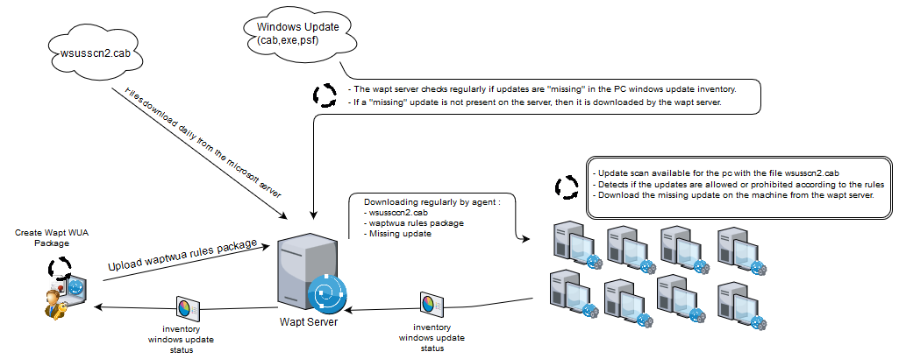

.. Reminder for header structure :
   Niveau 1 : ====================
   Niveau 2 : --------------------
   Niveau 3 : ++++++++++++++++++++
   Niveau 4 : """"""""""""""""""""
   Niveau 5 : ^^^^^^^^^^^^^^^^^^^^

.. meta::
  :description: Using the WAPT console
  :keywords: WAPT, console, documentation

.. _wapt_console:

.. versionadded:: 1.7

Uses of windows update
====================================

.. note::

	Since version 1.7, wapt is able to manage Windows updates on your parc.

	The operation of waptwua is based on "Windows Update Agent API".

	For more information : https://docs.microsoft.com/en-us/windows/desktop/wua_sdk/using-the-windows-update-agent-api

Principle
-----------

Regularly, the wapt server downloads a file "wsuscn2.cab" from the Microsoft server. (once a day, the files will not be downloaded if they have not changed since the last download.)

The wsuscn2.cab file will allow the Windows Update Agent to check for the necessary updates on the machine. (The wapt agent directly download the wsuscn2.cab file from wapt server)

Regularly, the machine will analyze the available updates with this file. The list is then sent to the wapt server.

If an update is pending on the machine, if this update is not present on the wapt server, then the wapt server will download this update.

This mode of operation allows you to download only updates necessary for your parc.

.. note:: 

	All updates are stored in the waptwua folder of the wapt server.

	On linux : /var/www/waptwua
	
	And on windows : 
	
	C:\\wapt\\waptserver\\repository\\waptwua
	
.. hint::

	The update windows update download is based on repo_url in wapt-get.ini
	
	Your secondary repository will be fully operational with wapt windows update to reduce bandwidth.
	
	Be careful, do not forget to synchronize the waptwua folder.
	
	
Configure waptwua on the wapt agent
--------------------------------------------

To configure waptwua you can configure it in the wapt-get.ini file.

Add a waptwua section  : [waptwua]

You then have several options :

.. tabularcolumns:: |\X{5}{12}|\X{7}{12}|

====================================== ==================================== =========================================================================================================================
Options                                Default Value               			Description
====================================== ==================================== =========================================================================================================================
``enabled``                            False                       			Enable or disable waptwua on this machine.
``offline``                            True                        			Defined if the scan should be with the files wsuscn2.cab or Online with the microsoft servers.
``allow_direct_download``        	   False						        Allow direct download of updates from microsoft servers if the wapt server is not available.
``default_allow``                      False                                Set if missing update is accepted or not by default.
``filter``                             Type='Software' or Type='Driver'     Define the filter to apply for the update scan windows update       
``download_scheduling``				   None                                 Set the windows update scan recurrence (Will not do anything if wsus rule or wsuscn2.cab file have not changed) (ex: 2h)
``install_scheduling``                 None                                 Set the windows update install recurrence (Will not do anything if no update is pending) (ex: 2h)
``install_delay``                      None                                 Set a deferred installation time since online publication    (ex: 7d)
====================================== ==================================== =========================================================================================================================

.. hint::

	All of these options can be set when generating the agent.
	
	
Use waptwua from the console
--------------------------------------------

You have a tab "windows update" in the console wapt

Wapt Wua Package
+++++++++++++++++

The tab "Wapt Wua Package" allows you to create windows update rules packages.

When this type of package is installed on a machine, it indicates to the wapt wua agent the authorized or forbidden cab.

When several "Wapt Wua Package" packages are installed on a machine, then the rules will be merged.

When a cab is neither mentioned in authorized nor mentioned prohibited, wapt will then take the value of "default_allow" in wapt-get.ini

If an update has not yet been downloaded to the wapt server, then the update will be "missing" on the pc.

.. note::

	* If the wapt wua agent is set to default_allow = True, then it will be necessary to specify the prohibited cab.
	* If the wapt wua agent is set to default_allow = False, then it will be necessary to specify the authorized cab. 
	

.. hint::

	If your wua agent is configured with default_allow = False, 
	You can then test the new windows update on a small set of the parc.
	If the update is not a problem, then you can allow it for the entire fleet.

Windows update list tab
++++++++++++++++++++++++++++

The "Windows Update List" tab lists all windows updates.

The left pane allows you to filter the display by criticality, product, or classificiation.

In the grid, if the "downloaded on" column is empty, it means that the update was not downloaded by wapt and is not present on the server. (This update is missing on any post)

You can force the download of an update by right-clicking it and clicking Download seleted.

You can also force the download of the wsusscn2.cab file with the "download wsusscan cab from Microsoft Web Site" button

You can see the windows updates download on the server with the button "show download task"

.. hint::

	If one day your Windows update folder gets too big, then you can remove all windows update. Wapt will only download missing updates on the computers.
	
	
  
Complete diagram of the operation of WAPT windows update
------------------------------------------------------------------
  
  

