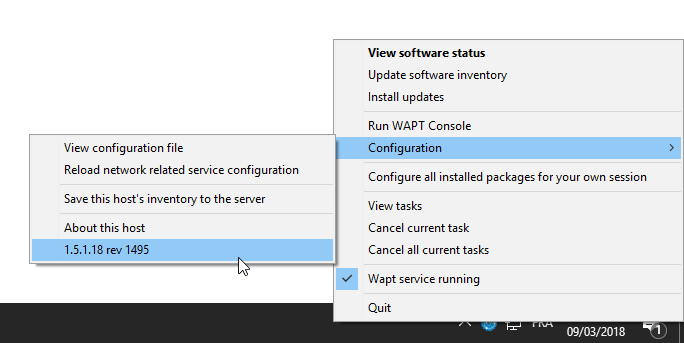

.. Reminder for header structure :
   Niveau 1 : ====================
   Niveau 2 : --------------------
   Niveau 3 : ++++++++++++++++++++
   Niveau 4 : """"""""""""""""""""
   Niveau 5 : ^^^^^^^^^^^^^^^^^^^^

.. meta::
   :description: Using WAPTtray.
   :keywords: WAPT, Tray, documentation

.. _wapttray:

Using WAPTtray.
===============

:program:`wapttray` is a utility working in user context, it is located
in the WAPT folder :file:`C:\\Program Files (x86)\\wapt`.

:program:`wapttray` launches at logon if the option has been ticked
during installation. The icon will show up in the Windows tray toolbar.

We can also launch :program:`wapttray` manually with a startup GPO pointing
on :file:`C:\\Program Files (x86)\\wapt\\wapttray.exe`.

The tray icon is handy for autonomous users that want to choose the right moment
to upgrade their packages.

  WAPTtray in Windows notification tray

.. raw:: html

  
<iframe width="560" height="315" src="https://www.youtube.com/embed/9iG36IeHuVc?rel=0&amp;showinfo=0" frameborder="0" allowfullscreen></iframe>

Functionalities of the WAPTtray
-------------------------------

.. list-table:: List of functionalities of the WAPTtray
  :header-rows: 1
  :align: center

  * - Action
    - Description
  * - Showing the status of packages
    - launches the local web interface in a browser
  * - Launching the installation of a update
    - launches the installation of pending upgrades
  * - Refreshing the list of available
    - refreshes the list of available packages. Double-clicking on the tray
      icon brings about the same effect.
  * - Launching the WAPT console
    - launches the WAPT console
  * - Viewing the configuration file
    - opens the :file:`C:\\Program Files (x86)\\wapt\\wapt-get.ini` file
      with :term:`Local Administrator` privileges (credentials may be asked)
  * - Reloading network related service configuration
    - reloads the connection to the WAPT Server in the event
      of a network reconfiguration
  * - Uploading the host's inventory to the WAPT Server
    - updates the host's inventory with the WAPT Server
  * - Configuring all installed packages for the User
    - launches a :command:`session-setup` to configure user environment
      for all packages installed on the host
  * - Canceling WAPT tasks running on the host
    - shows running tasks, allows to cancel a running task, allows to cancel
      all running tasks
  * - Stopping and starting the WAPT service
    - stops and reloads the *WAPTservice*
  * - Exiting the WAPTtray
    - closes the tray :guilabel:`icon` without stopping the local *WAPTservice*
