.. Reminder for header structure :
   Niveau 1 : ====================
   Niveau 2 : --------------------
   Niveau 3 : ++++++++++++++++++++
   Niveau 4 : """"""""""""""""""""
   Niveau 5 : ^^^^^^^^^^^^^^^^^^^^

.. meta::
  :description: Using the WAPT console
  :keywords: WAPT, console, documentation

.. _wapt_console:

Using the WAPT console
======================

.. note::

  Some functionalities detailed here are only available with the **Enterprise**
  version of WAPT.

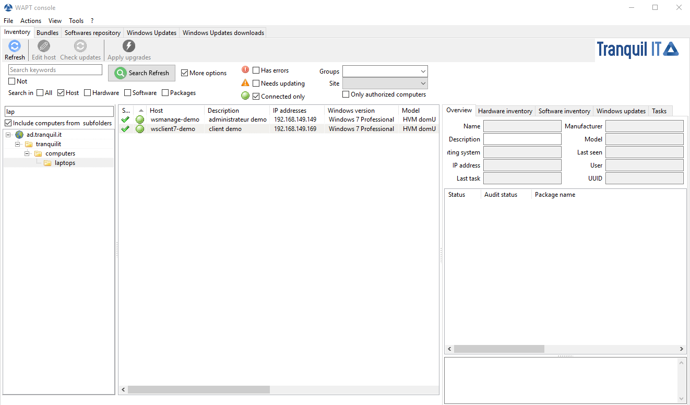

  Software inventory as registered in the Windows registry of the host

How to perform actions of the hosts?
------------------------------------

.. figure:: wapt_console-host-configuration-menu.png
  :align: center
  :alt: Host configuration menu

  Host configuration menu

.. table:: List of actions available to be performed on the hosts from the WAPT console
  :widths: 20, 50, 20
  :align: center

  ===================================================== ========================
  Description                                           Multi-selection
  ===================================================== ========================
  Edit the configuration of the host                    *yes*
  Refresh the list of available packages                *yes*
  Offer the user to launch an upgrade                   *yes*
  Send a message to the selected hosts                  *yes*
  Audit the packages installed on selected hosts        *yes*
  Add one or more packages on selected hosts            *yes*
  Remove one or more packages from selected hosts       *yes*
  Prevent packages from being installed on hosts        *yes*
  Add one or more packages on selected hosts            *yes*
  Remove the host and/or the host package               *yes*
  Launch TIShelp with a remote host                     *no*
  Initiate a VNC connection with the remote host        *no*
  Launch a RDP connection on the selected host          *no*
  Launch remote user support (msra.exe)                 *no*
  Manage hosts with :program:`compmgmt.msc`             *no*
  Manage Users and Groups with :program:`lusrmgr.msc`   *no*
  Manage Services with :program:`services.msc`          *no*
  Send a WakeOnLAN special packet to selected hosts     *yes*
  Search for applicable Windows updates                 *yes*
  Download pending Windows updates                      *yes*
  Trigger the installation of pending Windows updates   *yes*
  Add Active Directory groups to the selected machines  *yes*
  Trigger an inventory update on selected hosts         *yes*
  Restart the WAPT service                              *yes*
  ===================================================== ========================

Searching a host
----------------

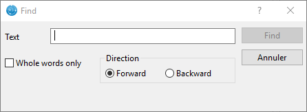

  *Search* function in WAPT

Allow to search for a value in the selected column.

Filters and actions available with Organisational Units
-------------------------------------------------------

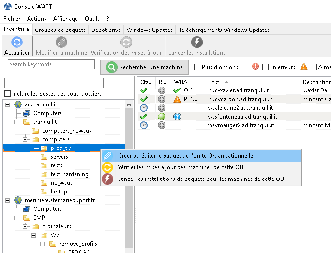

  WAPT console showing options applicable to OU

In the **Enterprise** version, you may filter how hosts are displayed based
on the Active Directory :abbr:`OU (Organizational Units)` they belong to.

The checkbox :guilabel:`Include hosts in subfolders` allows to display hosts
in subfolders.

You may also choose to create *unit* packages by :menuselection:`Right clicking
on an OU --> Create or edit the unit package`.

Show the inventory
------------------

When the WAPT agents :command:`register`, they send some informations
to the WAPT Server.

Informations displayed in the console are not updated in real-time, you have
to refresh the display to view new status and informations.

Click on the :guilabel:`Refresh` button or press :kbd:`F5` on the keyboard.

.. figure:: wapt_console-main-grid.png
  :align: center
  :alt: WAPT console displaying inventory

  WAPT console displaying inventory

The WAPT console lists hosts that are registered with the WAPT Server
and some informations that are useful for managing the hosts.

Selecting a host displays its informations in the right panel of
the WAPT console (:guilabel:`Hardware inventory` and
:guilabel:`Software inventory`).

Hardware inventory displays the hardware inventory of the host
--------------------------------------------------------------

Common informations displayed in the :guilabel:`Hardware inventory` tab are:

* the name of the host;

* the description of the host;

* the operating system running on the host;

* the IP address of the host;

* the last WAPT task that was run on the host;

* the manufacturer of the host;

* the model of the host;

* the date of the latest update on the host;

* the name of the user last or currently connected on host;

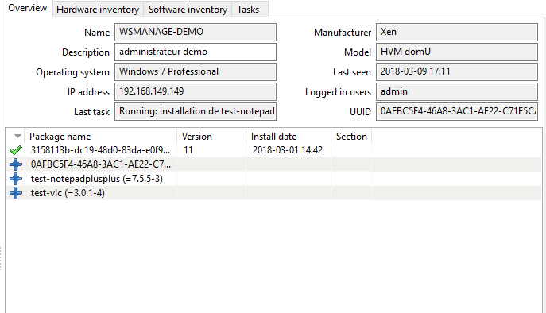

  Host summary

.. table:: Status of packages in the WAPT console
  :widths: 60, 20
  :align: center

  ============================================= ================================
  Description                                   Status
  ============================================= ================================
  List of installed WAPT packages               Status: **OK**
  List of packages waiting to be installed      Status: **MISSING**
  List of packages pending updates              Status: **NEED-UPGRADE**
  List of packages that have failed to install  Status: **ERROR**
  ============================================= ================================

When a package returns a status **ERROR**, click on it to show the details
of the error. Errors are print messages in the :file:`setup.py`
of your packages.

.. figure:: wapt_console-host-in-error.png
  :align: center
  :alt: Error detail

  Error detail

Acting on packages installed on a host
++++++++++++++++++++++++++++++++++++++

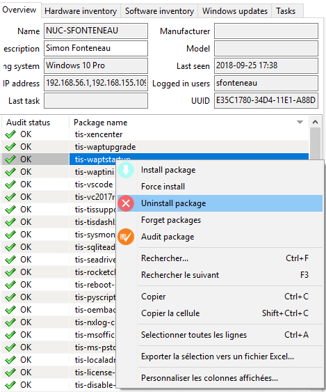

  Possible actions for WAPT packages

.. hint::

  * multiple selection of packages is possible;

  * the host must be seen by the WAPT Server when the action is launched;

  * if several hosts are selected, the action will be launched on all
    selected hosts;

.. table:: Acting on packages installed on a host
  :widths: 60, 20
  :align: center

  =================== ==========================================================
  Action              Description
  =================== ==========================================================
  Install a package   installs the selected package on selected hosts

  Force a package     forces the re-installation of a selected package
                      on selected hosts

  Remove a package    removes the selected package from the selected hosts

  Forget a package    tells the selected hosts not to use WAPT for managing
                      the selected package

  Audit the package   triggers an audit on the selected package
  =================== ==========================================================

Hardware inventory tab
++++++++++++++++++++++

Informations displayed by default in the :guilabel:`Hardware inventory`
tab are:

* informations on the host's hardware components;

* some informations about the host;

* some information on the status of WAPT;

.. figure:: wapt_console-hardware-inventory.png
  :align: center
  :alt: Host hardware inventory

  Host hardware inventory

A :guilabel:`Filter` box allows to search for hosts.

.. hint::

  Filters work with `regular expression <https://en.wikipedia.org/wiki/Regular_expression>`_.

To add a column in the grid, drag and drop a hardware property from
the :guilabel:`Hardware inventory` grid to the main grid.

Example: in :guilabel:`hosts`, drag and drop *physical_memory*
in the left panel, and the column :guilabel:`physical_memory`
appears in the main grid.

.. figure:: wapt_console-add-filter-column-to_grid.png
  :align: center
  :alt: Adding a criteria to the main grid of the WAPT console

  Adding a criteria to the main grid of the WAPT console

Software inventory tab
++++++++++++++++++++++

Common informations displayed in the :guilabel:`Sofware inventory` tab are:

* :guilabel:`maker`

* :guilabel:`software name`

* :guilabel:`software version`;

* :guilabel:`installation date`;

* :guilabel:`uninstall key`;

* :guilabel:`uninstall string`;

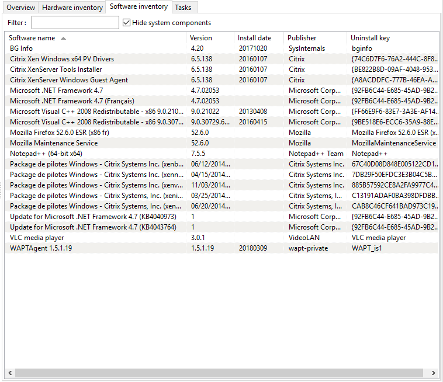

  Software inventory as registered in the Windows registry of the host

Windows update tab
++++++++++++++++++

Informations displayed in the :guilabel:`Hardware inventory` tab are:

* Windows update agent version;

* date of the last Windows update scan;

* duration of the last scan;

* WAPTWUA status;

* date of the last version of :file:`wsusscn2.cab` processed by WAPT;

* status of  WAPTWUA Enabled (True/ False);

  The grid then lists Windows cab files that have been installed
  or that are pending installation.

Informations displayed in the :guilabel:`Windows Updates` tab are:

* :guilabel:`Status`;

* :guilabel:`Product`;

* :guilabel:`Update ID`;

* :guilabel:`Kbids`;

* :guilabel:`Published on`;

* :guilabel:`installation on`;

* :guilabel:`Severity on`;

* :guilabel:`Classification`;

* :guilabel:`Title`;

* :guilabel:`Download size`;

.. figure:: wapt_console-windows-update-inventory.png
  :align: center
  :alt: Inventory of Windows Updates

  Inventory of Windows Updates

Task tab
++++++++

Informations displayed by default in the :guilabel:`Tasks` tab are:

* pending tasks;

.. figure:: wapt_console-pending-task-grid.png
  :align: center
  :alt: Details of pending tasks on the host

  Details of pending tasks on the host

* completed tasks;

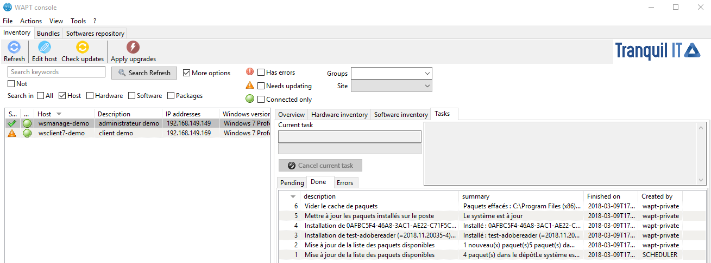

  Details of completed tasks

* tasks in error;

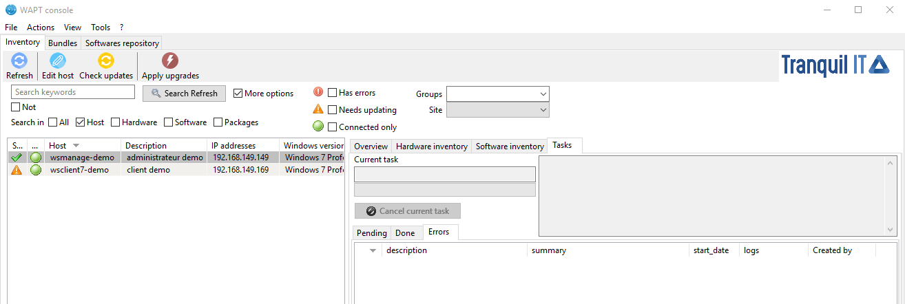

  Details of tasks in error

Perform a global search on all hosts
------------------------------------

Performing global searches on all the criteria presented above is possible.

Choose the filters to check or uncheck.

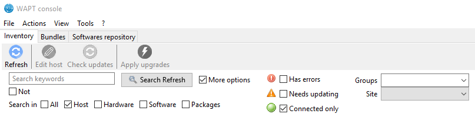

  Advanced search functionalities in the WAPT console

.. table:: Choice of filters
  :widths: 60, 20
  :align: center

  ============================= ================================================
  Possible options              Description
  ============================= ================================================
  :guilabel:`Host`              :guilabel:`Host` section in the
                                :guilabel:`Hardware inventory` tab when
                                a host is selected

  :guilabel:`Hardware`          :guilabel:`DMI` section in the
                                :guilabel:`Hardware inventory` tab when
                                a host is selected

  :guilabel:`Software`          :guilabel:`Software inventory` section when
                                a host is selected

  :guilabel:`Package`           List of packages installed on the selected hosts

  :guilabel:`Have errors`       Search only for hosts for which a tasks
                                has not finished correctly

  :guilabel:`Needing upgrades`  Search only for hosts needing upgrades

  :guilabel:`Group selection`   Filter hosts based on their membership/
                                dependency to a group package
  ============================= ================================================

.. hint::

  Filters work with `regular expression <https://en.wikipedia.org/wiki/Regular_expression>`_.

Do a search based on a WAPT package
-----------------------------------

In the :guilabel:`Private repository`, select the package and then
click on :guilabel:`Show Hosts`.

The grid will display the hosts on which the package is installed.
Note that the filter is only active on the :guilabel:`Package` attribute
of the selected package.

The different columns display information about the packages installed
on the machine (e.g. *package version*, *package status*, *audit status*,
*installation date*, *architecture*).

.. figure:: wapt_console-show-hosts-configured-with-selected-package.png
  :align: center
  :alt: Filter by package

  Filter by package

You can also add the columns :guilabel:`Log install`
and :guilabel:`Last Audit Output` to display at a glance the installation
and audit logs.

Creating a group package
------------------------

Group packages allows to create a package containing other packages
to be affected as a dependency to a host.

To create a group of packages, go to the :guilabel:`Bundles` tab:

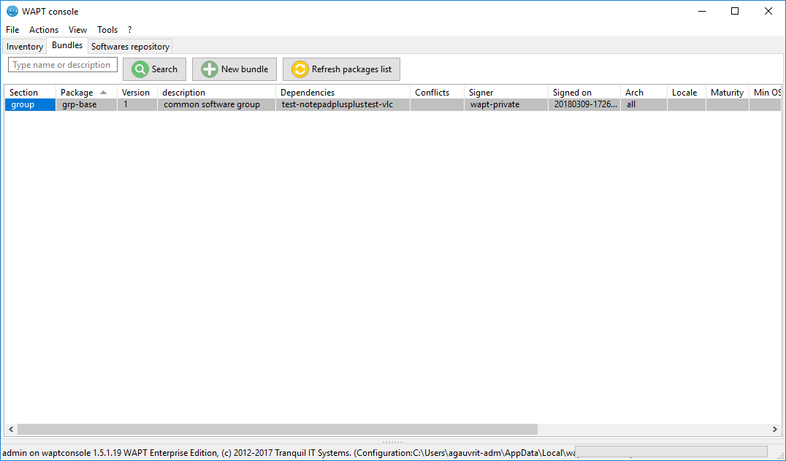

  Package group grid

* click on :guilabel:`New bundle`;

* give a name to the *group* package;

.. hint::

  If you name a group package with the same name as an Active Directory
  security group (Microsoft or Samba-AD), member of the Active Directory
  group can be automatically affected to the WAPT group package.

* fill in the description, add packages to the group package by dragging
  and dropping them or by Right-clicking on the package name,
  and adding to the bundle;

.. figure:: wapt_console-add-packages-to-group.png
  :align: center
  :alt: Creating a group package

  Creating a group package

* click on :guilabel:`Save` to save the bundle;

.. hint::

  To uninstall a package, it is possible to add banned packages to a bundle.

.. figure:: wapt_console-configure-forbiden-package.png
  :align: center
  :alt: Forbid a package

  Forbid a package

In the :guilabel:`Software Repository` tab, the list of packages currently
available in the WAPT repository appears. By default, the console will only
show the latest version of packages.

To display all package versions, untick :guilabel:`Last version only`.
To delete a package from the repository, :menuselection:`Right-click
--> Remove from repository`.

.. figure:: wapt_console-remove-package-from-repository.png
  :align: center
  :alt: Remove a package

  Remove a package

To edit a package, :menuselection:`Right-click --> Edit package`,
the package will be downloaded locally in **the base package
development directory** set in console settings.

Make changes to the package as wanted, rebuild the package and upload it back
to the repository. Once your package has uploaded, refresh the package list
using the :guilabel:`Refresh package list` button or by pressing :kbd:`F5`
on your keyboard.

A search bar is also available to filter packages.

Cleaning the local cache from the WAPT console
----------------------------------------------

When importing a package from Internet, the WAPT console downloads the package
in :file:`%appdata%\local\waptconsole\cache` .

To clean the cache and free up disk space, click on :menuselection:`Tools
--> Clean local cache`.

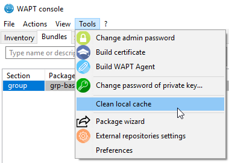

  Cleaning up the local cache

Changing the password of the WAPT Server
----------------------------------------

To change the WAPT Server password, click on :menuselection:`Tools
--> Update password`, fill in the old password and a new one.

.. _configuring_the_WAPT_console:

Making changes to the WAPT console preferences
----------------------------------------------

To make changes to console settings, go to :menuselection:`Tools
--> Preferences`.

.. figure:: wapt_console-access-to-menu-preferences.png
  :align: center
  :alt: Configuration options for the WAPT console

  Configuration options for the WAPT console

* :guilabel:`Basic` tab for basic options;

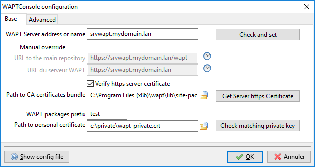

  Configuration options for the WAPT console

.. list-table::
  :header-rows: 1

  * - Arguments
    - Description
    - Example
  * - WAPT Server IP address
    - URL of the WAPT Server
    - *srvwapt.mydomain.lan*
  * - URL of the main WAPT repository
    - URL of the main WAPT repository (only if :guilabel:`Specify manually`
      is checked)
    - http://srvwapt.mydomain.lan/wapt/
  * - URL of the WAPT Server
    - URL of the WAPT Server (only if :guilabel:`Specify manually` is checked)
    - *https://srvwapt.mydomain.lan/*
  * - Verifying the HTTPS certificate
    - Indicates whether the HTTPS certificate must be verified
    - yes
  * - Path to the bundle of certificates
    - Path to the bundle of certificates that will allow certificates
      to be verified
    - Visit :ref:`the documentation on activating HTTPS verification
      <activating_HTTPS_certificate_verification>`
  * - Prefix to use when creating packages. Ex: *tis* or *demo*
    - Prefix that is given to packages during replication.
    - prefix
  * - Path to the Administrator's personal certificate
    - Path to the certificate associated with the private key used
      to sign packages
    - :file:`C:\private\mykey.crt`

.. hint::

  The button :guilabel:`Get the server certificate` downloads the WAPT Server
  HTTPS certificate to :file:`WAPT\ssl\serveur` and tells the WAPT console
  to verify HTTPS connections using that bundle of certificates. The method
  is called **Certificate pinning**. Before downloding the HTTPS certificate,
  you must be sure that you are connecting with the right server.

* :guilabel:`Advanced` tab for advanced options;

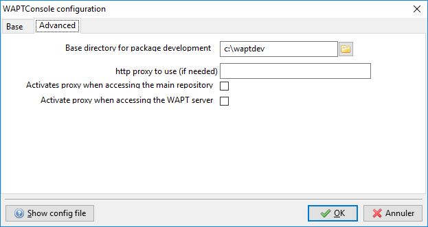

  Configuration options for the WAPT console

.. list-table::
   :header-rows: 1

  * - Arguments
    - Description
    - Example
  * - Path to waptdev folder
    - Indicates the path to the directory for storing packages being developed
    - :file:`C:\waptdev`
  * - HTTP proxy to use
    - Indicates a proxy server to be used by the WAPT console when accessing
      the WAPT repository or the WAPT Server
    - *http://srvproxy.mydomain.local:8080*
  * - Activating the proxy
    - Activate proxy settings for connecting to the WAPT repository
      or the WAPT Server
    - False

To make changes to console settings, go to :menuselection:`Tools
--> Preferences`.

.. list-table::
   :header-rows: 1

  * - Arguments
    - Description
    - Example
  * - Maximum number of hosts to be displayed in the console
    - Indicates the maximum number of hosts to be displayed in the WAPT console,
      so to optimize the behavior of the console.
    - 2000
  * - Langage
    - Selects the langage for the WAPT console
    - English
  * - Showing debug informations in the WAPT console
    - Shows debug informations in the WAPT console
    - True
  * - Allow third-party tools in the contextual menus of the hosts
    - TODO
    - True
  * - Activate administration functionalities
    - TODO
    - True
  * - Hide unavailable options
    - TODO
    - True

.. _generate_new_certificate:

Generating a new public certificate
-----------------------------------

.. versionadded:: 1.3.12.13

Generating a new public certificate allows to actualize an existing public
certificate without having to regenerate a public key/ certificate pair.

For that purpose, go to :menuselection:`Tools --> Generate a new certificate`

.. figure:: wapt_console-generate_new_certificate.png
  :align: center
  :alt: Generate a self-signed certificate

  Generate a self-signed certificate

The private key is recovered from current settings, change the **Common Name**
and regenerate a new certificate.

The old certificate will be invalidated.

.. figure:: wapt_console-new-certificate-confirmed.png
  :align: center
  :alt: New public certificate has been created

  New public certificate has been created
