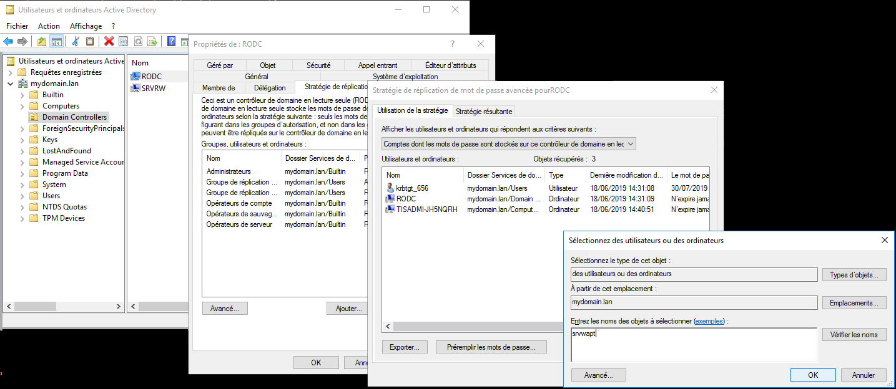

.. Reminder for header structure :
   Niveau 1 : ====================
   Niveau 2 : --------------------
   Niveau 3 : ++++++++++++++++++++
   Niveau 4 : """"""""""""""""""""
   Niveau 5 : ^^^^^^^^^^^^^^^^^^^^

.. meta::
  :description: Configuring Kerberos authentication on CentOS/ RedHat
  :keywords: Kerberos, authentication, Debian, WAPT, documentation, RedHat,
             CentOS

Configuring Kerberos authentication
+++++++++++++++++++++++++++++++++++

.. note::

  * this configuration is required when using WAPT **Enterprise** version;

  * indeed without Kerberos authentication, you have to either trust initial
    registration or enter a password for each workstation
    on initial registration;

  * for more information, visit the documentation on :ref:`registering a machine
    with the WAPT Server <initial_machine_registration>` and :ref:`signing
    inventory updates <signing_inventory_updates>`;

  * the kerberos authentication will be used only when registering the device;

.. SUBSTITUTION: kerberos installation instruction

Configuring krb5
""""""""""""""""

Modify the :file:`/etc/krb5.conf` file and **replace all the content with the
following 4 lines** replacing **MYDOMAIN.LAN** with your Active Directory
domain name (i.e. *<MYDOMAIN.LAN>*).

.. attention::

  ``default_realm`` must be written with **ALL CAPS**!!

.. code-block:: bash

  [libdefaults]
    default_realm = MYDOMAIN.LAN
    dns_lookup_kdc = true
    dns_lookup_realm=false

Retrieving a service keytab
"""""""""""""""""""""""""""

Use the :`command:`kinit` and :command:`klist`. You can use an
:term:`Administrator` account or any other account with the delegated
right to join a computer to the domain in the proper destination container
(by default *CN=Computers*).

In the shell transcript below, commands are in black and returned
text is commented in light gray:

.. code-block:: bash

  sudo kinit administrator
  ## Password for administrator@MYDOMAIN.LAN:
  ## Warning: Your password will expire in 277 days on lun. 17 sept. 2018 10:51:21 CEST
  sudo klist
  ## Ticket cache: FILE:/tmp/krb5cc_0
  ## Default principal: administrator@MYDOMAIN.LAN
  ##
  ## Valid starting       Expires              Service principal
  ## 01/12/2017 16:49:31  02/12/2017 02:49:31  krbtgt/MYDOMAIN.LAN@MYDOMAIN.LAN
  ## renew until 02/12/2017 16:49:27

If the authentication request is successful, you can then create your
HTTP Keytab with the :program:`msktutil` command.

Be sure to modify the *<DOMAIN_CONTROLER>* string with the name of your domain
controller (eg: **srvads.mydomain.lan**).

.. code-block:: bash

  sudo msktutil --server DOMAIN_CONTROLER --precreate --host $(hostname) -b cn=computers --service HTTP --description "host account for wapt server" --enctypes 24 -N
  sudo msktutil --server DOMAIN_CONTROLER --auto-update --keytab /etc/nginx/http-krb5.keytab --host $(hostname) -N

.. attention::

  Be sure to have properly configured your WAPT Server *hostname* before running
  these commands;

  In order to double check your *hostname*, you can run :code:`echo $(hostname)`
  and it must return the name that will be used by WAPT agent running
  on client workstations.

.. SUBSTITUTION: change ownership and permission on keytab

My wapt server does not have access to a write active directory
^^^^^^^^^^^^^^^^^^^^^^^^^^^^^^^^^^^^^^^^^^^^^^^^^^^^^^^^^^^^^^^^^^^^^^^^^^^^^^^^^^^^^^^^^

* Connect to your active directory (Not a RODC)

Create a computer account "srvwapt" (with graphical interface)

* Place the spn on the account "srvwapt$"

.. code-block:: bash

   setspn -A HTTP/srvwapt.mydomain.lan srvwapt
   
Create a keytab for this wapt server : 
   
.. code-block:: bash   

   ktpass -out C:\http-krb5.keytab -princ HTTP/srvwapt@MYDOMAIN.LAN rndpass -minpass 64 -crypto all -pType KRB5_NT_PRINCIPAL /mapuser srvwapt$@MYDOMAIN.LAN
   Reset SRVWAPT$'s password [y/n]?  y
   
Transfer this file in :file:`/etc/nginx/` (with winscp for example) 

Apply the right to the http-krb5.keytab file
""""""""""""""""""""""""""""""""""""""""""""""""""""""

.. code-block:: bash   

   sudo chmod 640 /etc/nginx/http-krb5.keytab
   sudo chown root:www-data /etc/nginx/http-krb5.keytab
   
Case of a use of a rodc
""""""""""""""""""""""""""""

* For **RODC** Add the srvwapt account to the allowed password group for replication

* Remember to preload the password of the wapt server with the different rodc server.

  
  
Test Keytab 
""""""""""""""""""""""""""""""""""""""""""""""""""""" 
 
If a RW or RODC server is available from the wapt server, you can test your keytab with this command :

.. code-block:: bash   
 
   kinit -kt /etc/nginx/http-krb5.keytab HTTP/srvwapt@MYDOMAIN.LAN
  
  
Post-configuring
"""""""""""""""""

You can now use post-configuration script to configure the WAPT Server
to use Kerberos.

The post-configuration script will configure :program:`Nginx`
and the WAPT Server to use Kerberos authentication.

.. hint::

  This post-configuration script must be run as **root**.

.. code-block:: bash

  /opt/wapt/waptserver/scripts/postconf.sh --force-https

Kerberos authentication is now configured.

.. note::

  The post-configuration script generates a self-signed certificate.
  If you prefer, you may replace it with a :ref:`commercial certificate or a
  certificate issued by a Trusted internal Authority of Certification
  <install_ssl_certificate>`.

Otherwise, go on directly to the next step to :ref:`installing
the WAPT console <installing_the_WAPT_console>`.
