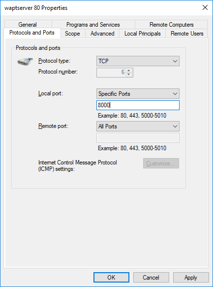
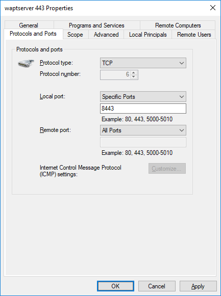

.. Reminder for header structure:
   Niveau 1: ====================
   Niveau 2: --------------------
   Niveau 3: ++++++++++++++++++++
   Niveau 4: """"""""""""""""""""
   Niveau 5: ^^^^^^^^^^^^^^^^^^^^

.. meta::
   :description: Changing the listening port of the WAPT Server
   :keywords: port, Windows, WAPT, firewall, IIS, Nginx, documentation

.. _windows_changing_port_80_443:

Changing the listening port of the WAPT Server
----------------------------------------------

.. note::

   In some cases, it is not possible to install the WAPT Server on a
   Windows machine because a service already occupies ports 80 and 443.

   It is the case if for example, a IIS web service is active on the host
   (example: anti-virus server, WSUS, web server ...).

   In that case, we will change the listening port on the :program:`Nginx`
   web server integrated to the WAPT Server.

Installing the WAPT Server
++++++++++++++++++++++++++

* The installation of WAPT still needs ports 80 and 443 be available
  when installing the WAPT Server, so the first step consists of stopping
  the service that listens on ports 80 and/ or 443 (IIS/ Anti-virus).

* launch now the installation of the WAPT Server and follow the
  post-configuration procedure, but do not launch the WAPT console.
  If you need guidance, you may follow the documentation
  to :ref:`install the WAPT Server on Windows <wapt-server_win_install>`.

* now stop the :program:`Nginx` service and the WAPT service:

  .. code-block:: bash

    net stop WAPTNginx
    net stop waptservice

* finally, restart the service that listens on ports 80 and/ or 443
  (IIS/ Anti-virus / Web server ...);

Configuring the new listening ports in the Nginx
++++++++++++++++++++++++++++++++++++++++++++++++

* open the file :file:`C:\\Program Files (x86)\\wapt\\waptserver\\nginx\\conf\\nginx.conf`

* replace the lines:

  .. code-block:: bash

    listen       80;
    listen       443 ssl;

  with:

  .. code-block:: bash

    listen       8000;
    listen       8443 ssl;

* restart :program:`Nginx` with :code:`net start WAPTNginx`;

* open :file:`C:\\Program Files (x86)\\wapt\\wapt-get.ini`;

* add the port to the specified URL, example:

  .. code-block:: bash

    repo_url=https://wapt.mydomain.lan:8443/wapt
    wapt_server=https://wapt.mydomain.lan:8443

* restart the WAPT service with :code:`net start waptservice`;

Making changes to firewall rules on the Windows devices
+++++++++++++++++++++++++++++++++++++++++++++++++++++++

You must now make changes to the two waptserver rules that were created
during initial installation: waptserver *waptserver 80* and *waptserver 443*.

* change the listening ports:

  Changing from port 80 to 8000

  Changing from port 443 to 8443

Go on to the next step to :ref:`launch the WAPT console <starting-waptconsole>`.

.. hint::

   If you had already launched the WAPT console, do not forget
   to change the port values in the WAPT console configuration
   file by clicking the :guilabel:`Wrench` on the console login screen.
