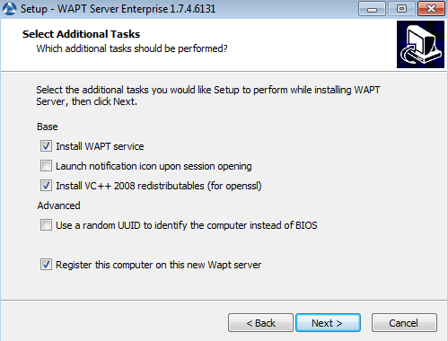
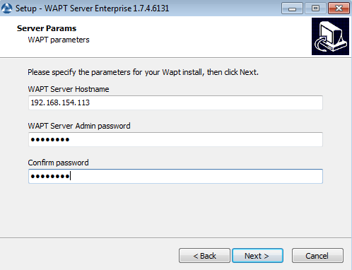
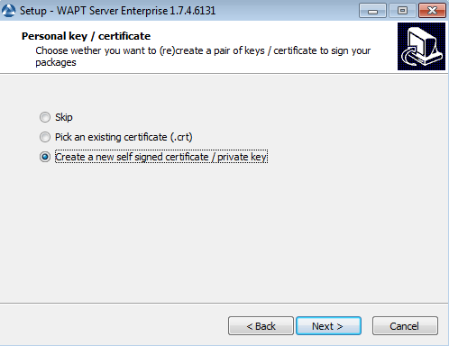
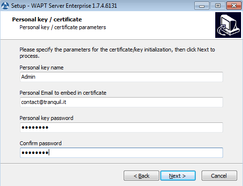
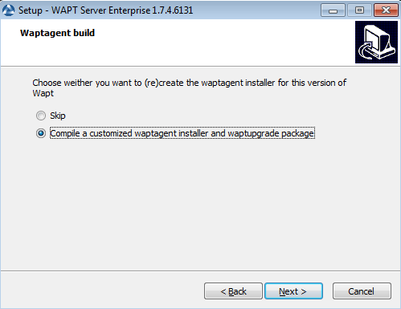
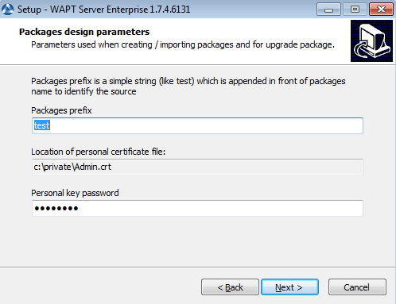
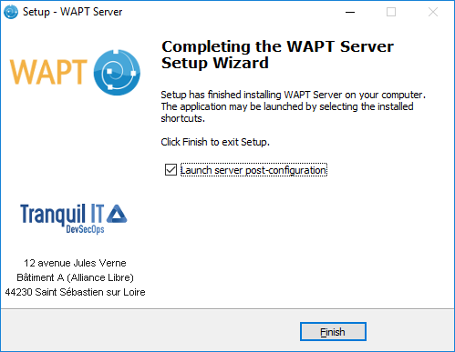

.. Reminder for header structure :
   Niveau 1 : ====================
   Niveau 2 : --------------------
   Niveau 3 : ++++++++++++++++++++
   Niveau 4 : """"""""""""""""""""
   Niveau 5 : ^^^^^^^^^^^^^^^^^^^^

.. meta::
    :description: Installing WAPT Server on Windows
    :keywords: Server, WAPT, Windows, install, installation, documentation

.. _wapt-server_win_install:

Installing WAPT Server on Windows
=================================

.. attention::

  * The WAPT Server can not be installed on a computer with services already
    listening on ports 80 and 443 (example WSUS with IIS).

  * ports 80, 443 and 8080 are used by the WAPT Server and must be available;

  * If ports 80 and 443 are already occupied by another web service,
    you should take a look at the documentation for :ref:`changing the default
    ports on Windows <windows_changing_port_80_443>`.

  * port 8088 is used on client machines by the WAPT agent and
    must be available;

  * The WAPT server **will not run** on a x86 version of Windows;

  * The installation of the WAPT server must be done using
    a **Local Administrator** account on the host;

.. attention::

  **From WAPT Server 1.5 onward**, :program:`Nginx` is the **ONLY**
  supported web server. **Apache or IIS (with or without WSUS) are no longer
  supported in WAPT**.

In case of problems when installing WAPT, visit the :ref:`Frequently
Asked Questions <wapt_faq>`.

.. note::

  * installing WAPT on a Linux server is the recommended method;

  * the WAPT Server may be installed on **64bit only** Windows 7, 8.1, 10
    and Windows Server 2008/R2, 2012/R2, 2016 and 2019;

* download and execute `waptserversetup.exe <http://wapt.tranquil.it/wapt/releases/latest/waptserversetup.exe>`_;

* choose the installation language;

.. figure:: windows-choose-language.png
  :align: center
  :alt: Choose the language for WAPT

  Choose the language for WAPT

* accept the GNU Public License and click on :guilabel:`Next` to go on
  to the next step;

.. figure:: windows-accept-wapt-license.png
  :align: center
  :alt: Accept the WAPT license terms

  Accept the WAPT license terms
  
  
* choose the installation directory (leave the default) and click
  on :guilabel:`Next` to go on to the next step;

.. figure:: windows-installation-folder.png
  :align: center
  :alt: Choose the WAPT destination folder

  Choose the WAPT destination folder
  
  
* Choose additional task (leave as is for a first installation)

  Choose additional task 
  
* Choose password for waptserver

  Choose Password 
  
  
* Create a key if this is your first installation, otherwise select the existing key.

  Create Key
  

* Choose Password for private key

  Choose Password for private key
  
  
* Build waptagent 

  Choose Build waptagent 
  
* Choose prefix 

  Choose prefix  
  

* click on the :guilabel:`Install` to launch the installation,
  wait for the installation to complete, then click on
  :guilabel:`Finish` (leave default options);

.. figure:: windows-installation-in-progress.png
  :align: center
  :alt: Progress of installation of the WAPT Server

  Progress of installation of the WAPT Server

  Installation has finished

* click on :guilabel:`Finished` to close the installer;

.. note::

   *Kerberos authentication for initial desktop registration* is not available
   on WAPT Server on Windows. If you require strong authentication
   for registration, please install a WAPT Server on Linux.

   The post-configuration wizard will generate a self-signed certificate.
   If you prefer, you may install a :ref:`commercial certificate or a
   certificate from an internal Certificate Authority <install_ssl_certificate>`.

The WAPT Server on your Windows is ready.

You may go to the documentation on :ref:`installing the WAPT console
<installing_the_WAPT_console>`!!
