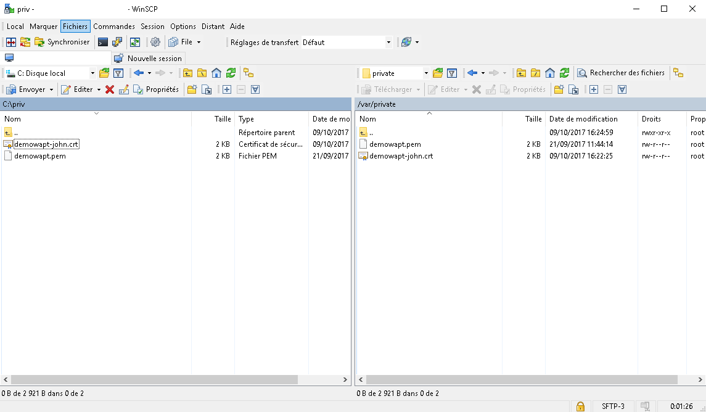

.. Reminder for header structure :
   Niveau 1 : ====================
   Niveau 2 : --------------------
   Niveau 3 : ++++++++++++++++++++
   Niveau 4 : """"""""""""""""""""
   Niveau 5 : ^^^^^^^^^^^^^^^^^^^^

.. meta::
  :description: Finishing the upgrade process from 1.3.13 to 1.6
  :keywords: backup, backing up, restoring, restore, server, WAPT, private key,
             Code Signing, waptupgrade, documentation

.. _key-regenerate:

Defining a password for the Administrator's private key
-------------------------------------------------------

The WAPT console has lost the path to the private key,
it is normal because in 1.3 the WAPT console was pointing to the private key.
Now in 1.5, the WAPT console points to the certificate associated
with the private key.

Go to :menuselection:`Tools --> Preferences --> Path to personal certificate`,
then fill in the path to the new certificate.

.. figure:: select_certificate.png
  :align: center
  :alt: Select the private key certificate

  Select the private key certificate

WAPT 1.6 requires to protect the private key with a password
to sign packages and actions.

In the WAPT console, go to :menuselection:`Tools
--> Change the password of the private key`, then select your certificate
and enter a password for your private key.

Generating a *Code Signing* certificate
---------------------------------------

WAPT 1.6 differentiates **Code Signing** certificates
from simple **SSL** certificates.

It is therefore necessary to regenerate a **Code Signing** certificate.

By default, WAPT 1.6 Community generates
self-signed **Code Signing** certificates.

You must insure that the old certificate in :file:`C:\\private\\mykey.crt`
and the key :file:`C:\\private\\mykey.pem` are present in :file:`C:\\private`.

.. attention::

  For packages to be deployed on the :term:`Organization`'s computers,
  all packages will have to be re-signed with a *Code Signing* certificate.

To create the *Code Signing* certificate, in the WAPT console go to
:menuselection:`Tools --> Generate a certificate`.

.. figure:: code_signing_certificate.png
  :align: center
  :alt: Code Signing certificate

  Code Signing certificate

.. note::

   Normally, you will not have to recreate a new key. Only the certificate
   will have to be changed. **You must enter the path to your key**
   (ex: :file:`C:\\private\\mykey.pem`).

.. attention::

  Do not make changes to the informations on the certificate. If any information
  is changed, then you will not be able to migrate from 1.3.13 to 1.6 using
  the :program:`waptupgrade` procedure.

The WAPT console now asks you whether the new certificate should be added
to the :file:`ssl` folder of the local WAPT agent, you can accept.

Now that you have generated your new key you must now change the path
to your personal certificate. The WAPT console must now point to this
new certificate.

Go to :menuselection:`Tools --> Preferences --> Path to personal certificate`,
then fill in the path to the new certificate.

.. figure:: new_certificate_select.png
  :align: center
  :alt: New Code Signing certificate

  New Code Signing certificate

You may now delete the old certificate.

Re-signing the packages on your WAPT repositories
-------------------------------------------------

**All WAPT 1.3.13 must be re-signed** because WAPT 1.6 packages
must be signed with a *Code Signing* certificate and hashed with sha256.

Linux
+++++

You must temporarily copy your private key (:file:`.pem`)
and the *Code Signing* certificate (:file:`.crt`) on your Linux based WAPT
Server using :program:`WinSCP` or an equivalent tool.

  Temporarily upload your Code Signing certificate on the WAPT server

Then, connect with SSH to the Linux WAPT Server and re-sign all WAPT
*base* packages with the new certificate:

.. code-block:: bash

  PYTHONPATH=/opt/wapt PYTHONHOME=/opt/wapt python /opt/wapt/wapt-signpackages.py -i -s --message-digest=sha256,sha1 -c /root/wapt-private-20180312-1522.crt /var/www/wapt/*.wapt

.. hint::

  The WAPT Server :term:`SuperAdmin` password is requested to access
  the database so to do the matching between :term:`FQDN` and
  their corresponding :term:`UUID` .

Rename host packages with the UUID nomenclature:

.. code-block:: bash

  PYTHONPATH=/opt/wapt PYTHONHOME=/opt/wapt python /opt/wapt/waptserver/scripts/migrate-hosts.py  -C /root/wapt-private-20180312-1522.crt  -K /root/wapt-private.pem

.. note::

  The private key now password protected, the password is requested
  for signing the packages.

.. attention::

  **DO NOT FORGET** to delete the private key (.pem) from the WAPT Server!

Windows
+++++++

Then, open a session on the Windows machine hosting the WAPT Server
and re-sign all WAPT base packages with the new certificate:

.. code-block:: bat

   wapt-signpackages -i -s --message-digest=sha256,sha1 -c C:\private\wapt-private-20180312-1522.crt C:\wapt\waptserver\repository\wapt\*.wapt

.. hint::

 The WAPT Server :term:`SuperAdmin` password is requested to access
 the database so to do the matching between FQDNs and their corresponding UUIDs.

Rename *host* packages with the UUID nomenclature:

.. code-block:: bat

  "C:\wapt\waptserver\scripts\migrate-hosts.bat" -C C:\private\wapt-private-20180312-1522.crt -K C:\private\wapt-private.pem

.. note::

  The private key now password protected, the password is requested
  for signing the packages.

.. attention::

  **DO NOT FORGET** to delete the private key (.pem) from the WAPT Server!

Generating the PostgreSQL database table for the group packages
---------------------------------------------------------------

In WAPT 1.3, group filtering was done by scanning the :file:`Packages`
index file in the :file:`wapt-host` folder of the WAPT Server.

For performance reasons, the filtering is now done by querying
a PostgreSQL database table. The table will fill in automatically as WAPT agents
register with the WAPT Server 1.6.

To quickly regenerate the database table, the trick is to create
a temporary group *mig-temp*.

You may then apply the *mig-temp* package to all WAPT clients
from the WAPT console (:kbd:`CTRL+A` in the inventory, then
:menuselection:`Right-click --> Add dependencies` and
select the package *mig-temp*).

You may now revert the operation (:kbd:`CTRL+A` in the inventory,
then :menuselection:`Right-click --> Remove dependencies` and select
the package *mig-temp*).

The filtering of groups should be operational again.

Ugrading WAPT agents
--------------------

You may now follow the procedure to :ref:`create the new WAPT agent
<create_WAPT_agent>`.

.. attention::

  The version update implies a change in the way packages are signed.

  If you update from 1.3.13, the WAPT package :program:`waptupgrade` should
  install correctly if you check the box :guilabel:`sign waptupgrade
  with sha256 AND sha1` while generating the WAPT agent.

  If your WAPT agents are in a version that is less than 1.3.13,
  the package :program:`waptupgrade` **will not work**.

You may choose instead to use a :command:`waptdeploy` GPO to
:ref:`deploy the new WAPT agent on your installed base of PCs
<install_waptagent>`.

Installing waptupgrade on the computers
---------------------------------------

With version 1.6, it is no longer possible to directly contact WAPT agents
in an inferior version from the WAPT console.

To allow you to install the *waptupgrade* package on 1.3.13 computers,
we have designed a small script.

Linux
+++++

You may thus launch the script:

.. code-block:: bash

  /opt/wapt/waptserver/trigger_action.sh prefix-waptupgrade

Windows
+++++++

You may thus launch the script:

.. code-block:: bat

  "C:\wapt\waptserver\trigger_action.bat" prefix-waptupgrade
